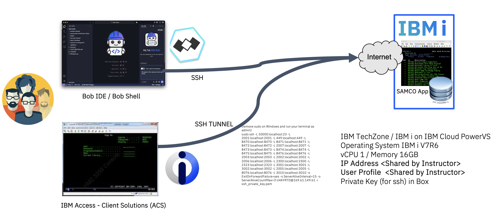
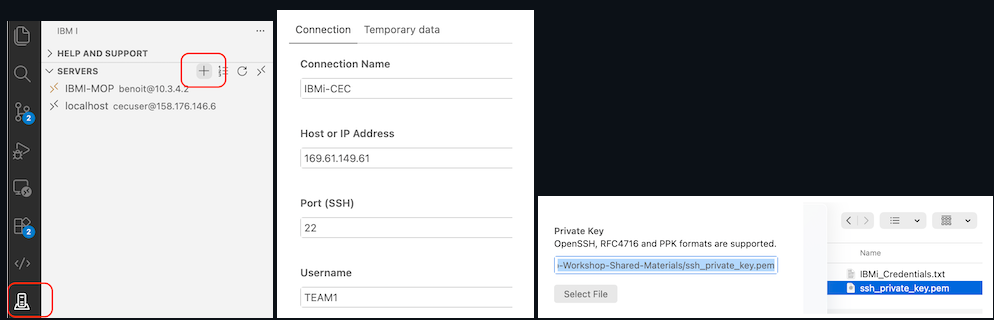
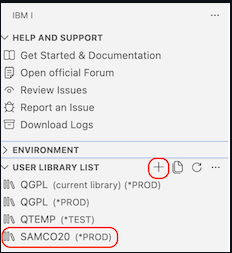
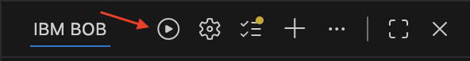
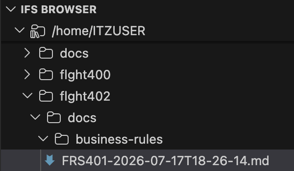
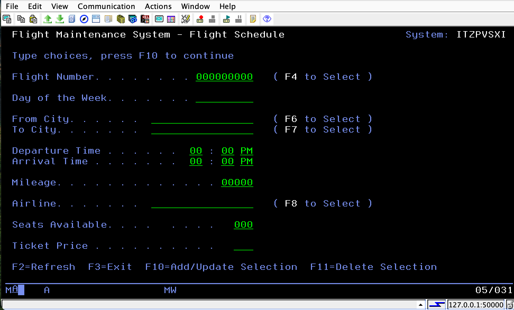
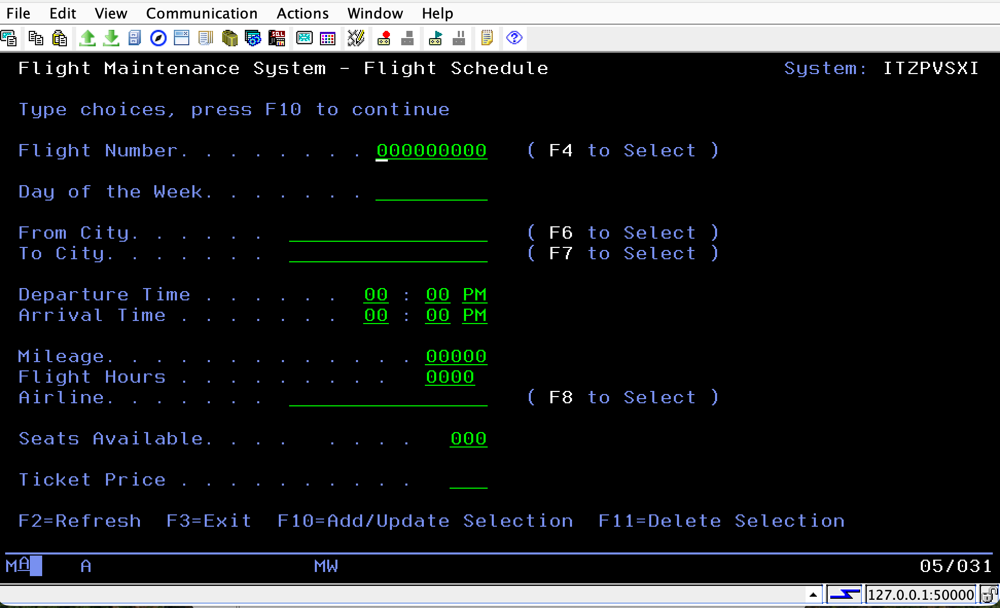
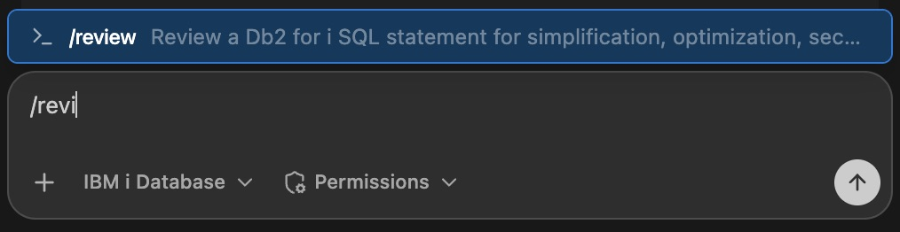
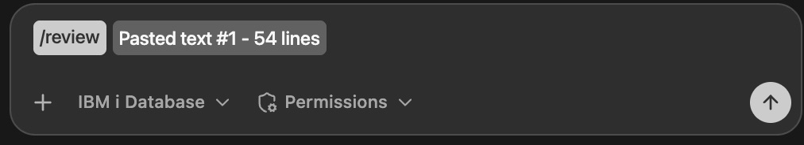

# FLIGHT400 Application — IBM i Modernization Lab Guide

> **Estimated time:** 2–3 hours  
> **Prerequisites:** IBM Bob IDE installed, internet access, IBM i TechZone LPAR (see below), and the Premium Package for i 


 
---

## Part 0 — Environment Setup 

### How to Get an IBM i Virtual Machine (aka LPAR)
#### Note: Only Instructors need to complete steps 1-4

To complete this lab, you need access to an IBM i environment. You can provision a free IBM i LPAR through **IBM TechZone**.

1. Go to [https://techzone.ibm.com](https://techzone.ibm.com) and log in with your IBM ID.
2. Search for **"IBM i"** in the catalog, and select an **IBM i 7.6** environment (e.g. *IBM i 7.6 - Sandbox*).  Go to this Collection: https://techzone.ibm.com/collection/techzone-certified-power-vs-base-vms and book your IBM i 7.6 Virtual Machine.

3. Click **Reserve** and fill in the reservation form:
   - **Purpose:** Demo / Self-Education / Test / Pilot
   - **Opportunity information:** misc. information related to your activity.
   - **Geography:** pick the region closest to you (AP, EU, Americas)
4. Submit the reservation. Within a few minutes you'll receive an email with your LPAR's **hostname/IP Address**, **port**, **user profile**, **private key** and **password**.
5. Keep these credentials handy — you'll need them in the next step to connect Bob IDE to your IBM i. By default this TechZone provisioned IBM i VM will be reachable through Https (443) and SSH (22). Bob and Code for i extension uses ssh. If you want to access your VM with other protocols and services (5250, MCP, database etc.) , you'll have to establish a reverse ssh tunnel as mentioned [here on the IBM Cloud PVS docs web site](https://cloud.ibm.com/docs/power-iaas?topic=power-iaas-connect-ibmi#ssh-tunneling). Basically, each user must execute this ssh command on their laptop, and use the appropriate host and port to reach the corresponding service (In the example below, localhost on port 50000 with ACS for 5250, etc.).
6. Download the private key from TechZone 
```bash
#SSH TUNNEL (ACCESS TO 5250 and other services)
chmod 600 ssh_private_key.pem
```
```bash
##then (remove sudo on Windows and run your terminal as admin)
sudo ssh -L 50000:localhost:23 -L 2001:localhost:2001 -L 449:localhost:449 -L 8470:localhost:8470 -L 8471:localhost:8471 -L 8472:localhost:8472 -L 2007:localhost:2007 -L 8473:localhost:8473 -L 8474:localhost:8474 -L 8475:localhost:8475 -L 8476:localhost:8476 -L 2003:localhost:2003 -L 2002:localhost:2002 -L 2006:localhost:2006 -L 2300:localhost:2300 -L 2323:localhost:2323 -L 2005:localhost:2005 -L 8076:localhost:8076 -L 3001:localhost:3001 -L 3002:localhost:3002 -L 3003:localhost:3003 -L 3004:localhost:3004 -L 3005:localhost:3005 -L 3006:localhost:3006 -L 3007:localhost:3007 -L 3008:localhost:3008 -L 3009:localhost:3009 -L 3010:localhost:3010 -L 3011:localhost:3011 -L 3012:localhost:3012 -L 3013:localhost:3013 -L 3014:localhost:3014 -L 3015:localhost:3015 -L 3016:localhost:3016 -L 3017:localhost:3017 -L 3018:localhost:3018 -L 3019:localhost:3019 -L 3020:localhost:3020 -L 3021:localhost:3021 -L 3022:localhost:3022 -L 3023:localhost:3023 -L 3024:localhost:3024 -L 3025:localhost:3025 -L 3026:localhost:3026 -L 3027:localhost:3027 -L 3028:localhost:3028 -L 3029:localhost:3029 -L 3030:localhost:3030 -L 3031:localhost:3031 -L 3032:localhost:3032 -L 3033:localhost:3033 -L 3034:localhost:3034 -L 3035:localhost:3035 -L 3036:localhost:3036 -L 3037:localhost:3037 -L 3038:localhost:3038 -L 3039:localhost:3039 -L 3040:localhost:3040 -L 3041:localhost:3041 -L 3042:localhost:3042 -L 3043:localhost:3043 -L 3044:localhost:3044 -L 3045:localhost:3045 -L 3046:localhost:3046 -L 3047:localhost:3047 -L 3048:localhost:3048 -L 3049:localhost:3049 -L 3050:localhost:3050 -o ExitOnForwardFailure=yes -o ServerAliveInterval=15 -o ServerAliveCountMax=3 <myuser>@<myIPaddress> -i ssh_private_key.pem
```
where `<myuser>@<myIPaddress>` is extracted from the information sent by TechZone , 

> 💡 on MacOS/Linux, you may need to use sudo ssh instead of ssh in the command above. Remove sudo on Windows (run as Administrator instead).

> 💡 If you don't have an IBM ID, create one for free at [https://www.ibm.com/account](https://www.ibm.com/account).

> 💡 For 5250 or Database access to IBM i, please install the IBM supported [ACS client Solutions](https://www.ibm.com/support/pages/ibm-i-access-client-solutions).



---

### Install the Premium Package for i / IBM i Developer Pack for VS Code and Bob IDE

1. Open **Bob IDE**.
2. Go to the **Extensions** view (`Cmd+Shift+X` / `Ctrl+Shift+X`).
3. Search for **"Premium Package"** and install the **Premium Package for i** (publisher: *IBM*), that depends on extensions contained in the **IBM i Developer Pack** . This bundle includes:
   - **Code for IBM i** — source editing, object browser, IFS browser, Db2 for i extension etc. 
4. After installation, reload Bob IDE when prompted.
5. In the **Bob** extension settings (Activity sidebar), ensure the **Premium Package for i** is activated — this unlocks the IBM i Developer and IBM i Database modes used in later exercises.

---

### Restore the FLIGHT400 Application - Only Required for Instructors

In this section you will deploy the FLIGHT400 save file to your IBM i LPAR and restore the application library. Please skip if Flight400 is already installed and go to the first Exercise.

#### 1.1 — Create a new local workspace

1. On your laptop, create an empty folder — for example `~/ibmi-lab`.
2. In Bob IDE go to **File → Open Folder** and open this new folder.
   Bob IDE will use this folder as your local workspace.
3. Download [`Install-Flight400.sql`](https://github.com/bmarolleau/flight400-demo/blob/main/Install-Flight400.sql) from this repository into that folder.

#### 1.2 — Download the save file into your workspace

From the [Box Folder](https://ibm.box.com/v/flight400-box), download **`FLGHT400.FILE`** into the folder you just opened.
This is an IBM i save file — a binary archive that contains the entire FLIGHT400 application (programs, source members, and database files), ready to be restored directly onto your LPAR.

Both files should now be visible in the IBM Bob IDE **Explorer** panel:

| File | Description |
|---|---|
| `FLGHT400.FILE` | IBM i save file containing the FLIGHT400 application |
| `Install-Flight400.sql` | SQL script that restores the application on IBM i |

#### 1.3 — Connect Bob IDE to your IBM i

1. In the Bob IDE Activity Bar, click the **IBM i** icon (plug icon).
2. Click **➕ New Connection** and enter the details from your TechZone reservation:
   - **IP/Host:** `<your-lpar-public-ip-address>`
   - **Username:** `<your-user-profile>`
   - **Password:** `<your-password>`
   - **Private Key:** If using PowerVS, let the **Password** field empty, download the private key, and set its path in this field.
3. Click **Connect**. A green status bar message confirms a successful connection.

#### 1.4 — Deploy the files to the IFS

1. In the Bob IDE **Explorer**, right-click on **`Install-Flight400.sql`**.
2. Choose **Deploy Selected Files**.  
   This uploads the entire workspace to an IFS directory on IBM i. The target IFS path is shown in the output panel — note it (e.g. `/home/YOURUSER/builds/ibmi-lab`). Note: you may get an error in the bottom right of the Bob panel where you have to set the deploy location. Keep the default or change it, then click deploy. 
3. In the Bob IDE **Explorer**, right-click on **`FLGHT400.FILE`**.
4. Choose **Deploy Selected Files**. 
   This uploads the entire workspace to an IFS directory on IBM i. The target IFS path is shown in the output panel — note it (e.g. `/home/YOURUSER/builds/ibmi-lab`).

> ☕ This may take a minute or two, Perfect time for a coffee break! 

The Save File `FLGHT400.FILE` contains the code, programs, database files etc. Everything you need to run the application. 

#### 1.5 — Verify the upload in the IFS Browser

1. In the IBM i sidebar, expand **IFS Browser**.
2. Navigate to the upload directory noted above (e.g. `/home/YOURUSER/builds/ibmi-lab`).
3. You should see `FLGHT400.FILE` and `Install-Flight400.sql` listed.
4. Right-click on `FLGHT400.FILE` and choose **Copy Path**. It will look something like:  
   `/home/YOURUSER/builds/ibmi-lab/FLGHT400.FILE`

#### 1.6 — Update the SQL install script

1. Open `Install-Flight400.sql` in the Bob IDE editor.
2. Locate and update these variables at the top of the script:
   - **`v_ifs_path`** — set to the IFS path you just copied (e.g. `/home/YOURUSER/builds/ibmi-lab/FLIGHT74.FILE`)
   - **`v_rst_lib`** — target library name after restore (default: `FLGHT400`; change only if needed)
   - **`v_owner`** — *(optional)* owner profile for the restored library. Leave as `NULL` to use `CURRENT_USER` automatically, or set explicitly (e.g. `DEFAULT 'MYPROFILE'`) to override.

3. Save the file (`Ctrl+S` / `Cmd+S`).

#### 1.7 — Run the SQL script

1. In the **IFS Browser**, refresh the folder. You should see `Install-Flight400.sql` updated. **Note: If it is not automatically updated, manually edit them in the IFS as you did in 1.6 and save the file.**
2. Right-click `Install-Flight400.sql` → **Run Action** → **Run SQL Statements**.
3. Wait for the script to execute (create save file, restore library, update library ownership).  
   The output console will confirm each step. The final `RSTLIB` command restores the full **FLIGHT400** library including programs, source members, and database files.

#### 1.8 - Copy the Library if you need a multi-user setup
1. Run CPYLIB FROMLIB(FLGHT400) TOLIB(FLGHT401) (and so on) so each participant gets their own isolated copy.
2. To do this, I asked Bob to run the command: 
   > Run CPYLIB FROMLIB(FLGHT400) TOLIB(FLGHT401) (and so on) so each participant gets their own isolated copy. I have X participants.
3. Bob will create libraries FLGHT401 through FLGHT4nn, each containing a full copy of all objects from FLGHT400. Each participant should then have their assigned library (e.g. FLGHT401) added to their library list.

> **Instructor:** Share this table with students before the lab starts. Each student uses their assigned library and dev port throughout all exercises.

| Student # | Library | Dev Port | React App URL |
|:---------:|---------|:--------:|---------------|
| 1  | FLGHT401 | 3001 | http://localhost:3001 |
| 2  | FLGHT402 | 3002 | http://localhost:3002 |
| 3  | FLGHT403 | 3003 | http://localhost:3003 |
| 4  | FLGHT404 | 3004 | http://localhost:3004 |
| … | … | … | … |
| 50 | FLGHT450 | 3050 | http://localhost:3050 |

> 💡 The **Dev Port** is only needed if you complete **Exercise 1 (Optional Warm-Up)**. When Bob asks you to pin your Vite dev server to a port, use the value from the **Dev Port** column above. Your React app will then be reachable at the **React App URL** shown — provided your SSH tunnel from step 6 is active.

> ✅ **End of Quick Setup.** The FLIGHT400 application is now restored on your IBM i in the `FLGHT4nn` library. 

> ✅ Make sure `FLGHT4nn` library is in your library list (in the Code for i settings). 

> ✅  If you have a 5250 terminal to your IBM i available, you can add the library to your lib list with `ADDLIBLE FLGHT4nn` if not already done, and launch the application from the CL (Green Screen) command prompt :  `GO FLGHT4nn/FRSMAIN` .

 > 💡 **Want to explore or troubleshoot the green-screen app?** See the [FLIGHT400 Quick Reference Guide](FLIGHT400-GUIDE.md) for navigation tips, menu structure, and common operations.

---

### Connection to IBM i
1. In Bob IDE, open the IBM i panel (left sidebar).
2. Click New Connection and enter the host IP, user profile, and password provided by your instructor.
- Establish the connection to your IBM i this is a standard connection to your IBM i.

3. In the Code for IBM i object browser, browse library FLGHT4nn where you replace nn with your library number given to you by the instructor (ex: FLGHT400, FLGHT401, etc.) — this contains the original source members (RPG, CL, DDS, SQL) for reference.
4. Then, add your library to the user library list.

That's all for now! You will explore the codebase more in Exercise 2. 
---

## Exercise 1 — Optional Warm-Up: Generate a React Carbon App from a Green Screen

**Goal:** Use Bob in **IBM i Developer** mode to analyze the FLIGHT400 *Create Order* 5250 screen and generate a modern React web application styled with the IBM Carbon Design System, running directly on IBM i PASE. This will take about 30 minutes to complete.

#### Instructor Prerequisites

Before the lab, use Bob to install Node.js 22 once on the IBM i partition used for the workshop:

> /QOpenSys/pkgs/bin/yum install -y nodejs22

Verify installation:

> /QOpenSys/pkgs/lib/nodejs22/bin/node --version
> /QOpenSys/pkgs/lib/nodejs22/bin/node \
   /QOpenSys/pkgs/lib/nodejs22/lib/node_modules/npm/bin/npm-cli.js --version

Expected results:

Node.js: v22.x.x
npm: 10.x.x


### Sharpen Your Skill 

Before generating the React app, give Bob some extra context about running React + Vite on IBM i PASE by creating a small helper Skill.

1. In Agent mode, click the **`+`** button (top right) and select **Local Workspace** as the task context.
2. Open [SAMPLE-SKILL.md](./SAMPLE-SKILL.md), copy its entire content, and paste it into the chat prompt.
3. Append the following instruction and send:

> *"Create a skill from the pasted text."*

### Expected Result

Bob creates a new Skill that improves its awareness of PASE-specific details for React and Vite projects. This lightweight Skill will be picked up automatically in the next step.

### Prompt in Bob Chat UI

- Switch to IBM i Developer mode, then Click on the `+` button (top right) and select  the `FLGHT4nn` (library list) as a context of for the task. **Update the FLGHTnn's with your library number**, paste this [screenshot](./pics/flight400.png) in the prompt, and ask:

> *"Given this screenshot of the 5250 flight order screen from the Application Flight4nn in @FLGHT4nn, Build a single-page React 18 + Vite 4 app on IBM i (PASE) using @carbon/react ^1.x with the g100 dark theme that modernises the IBM i 5250 screen shown in the attached screenshot. Create the app in the IFS at $HOME/flight4nn-frontend-apps/screen-name/. Use the g100 dark theme. All fields should have a list of values to select from. The dev server must run in the background using nohup … & and write output to /tmp/vite-dev.log. Pin the Vite dev server to port 30nn if available."*


### Expected Result

Bob generates a full React application, including:
- Carbon components (`Tile`, `TextInput`, `RadioButtonGroup`, `Modal`, `Button`) mirroring the 5250 layout
- Selection modals replacing DDS subfile windows
- The RPG pricing formula ported to JavaScript
- pure JavaScript, no native binaries, running natively in IBM i PASE

To see what files Bob generated, click 'Show all' on the 'File Changed' item at the Bottom of the Bob Chat Panel.

Start the app from your IBM i PASE shell:

```bash
cd /home/<your-user>/flight4nn-frontend-apps
# Build
/QOpenSys/pkgs/bin/bash build.sh

# Dev server (background — does not block your terminal)
nohup /QOpenSys/pkgs/bin/bash dev.sh > /tmp/vite-dev.log 2>&1 &

# Check which port Vite actually bound to:
cat /tmp/vite-dev.log
```

Or ask Bob to start the dev server for you!

Then open `http://localhost:30nn` in your browser. 
**Note that port number, and application look & feel can differ. If your browser isn't showing anything, make sure you've completed step 6 of environment setup and it includes your port.**


### Skills & Tools Used Behind the Scenes

In addition to the sample Skill we created in step 1, we've just used a set of unique Skills that are shipped with the Premium Package for i : 

| Tool / Skill | Role |
|---|---|
| `dds-primer-basics` skill | Parses `FRS001DF.DSPF` — screen layout, field names, subfile windows |
| `rpg-primer-basics` skill | Reads `FRS001.RPG` — extracts pricing logic and field definitions |
| IFS write tools | Creates project files directly in `$HOME/flight4nn-react/` on IBM i |
| IBM i PASE | Runs `npm install`, `npm run build`, `npm start` natively on IBM i |

Once you finish playing around with the react app. Ask Bob:

> Stop the web service for FLGHT4nn on port 30nn

> ⚠️ This app runs with sample data only. The natural next step is to add a REST / Web Services layer connecting the React front end to the real IBM i business logic and Db2 for i database.

---

## Exercise 2 — Code Explanation & Architecture Documentation

**Goal:** Use Bob's IBM i Developer mode to automatically generate an architecture overview with diagrams, then switch to Database mode to produce an Entity Relationship Diagram. This exercise takes about 30 minutes to complete.

### 2a — Browse the Application in the Object Browser

1. In the IBM i sidebar, expand **User Library List** and **Object Browser**.
2. Add **FLGHT4nn** to your library list if not done, and add a filter to the **FLGHT4nn** library in the Object Browser. To see everything, make sure the filter is *ALL, not just *SRCPF. Then navigate to the **FLGHT4nn** library in the Object Browser. You will see its contents organized by object type:
   - `*PGM` — RPG and CL programs (e.g. `FRS001`, `FRS021`, `FRS409`)
   - `*FILE` — Display files and database physical/logical files
   - `*MENU` — Application menus
3. Expand **Source Files** and browse `QRPGSRC` — open a couple of RPG programs to get a feel for the classic fixed-format style.
4. Navigate to **`QDDSSRCD`** and open the display file `FRS001DF`. In the editor, Click on **Preview All** on the first line of code. It renders the green-screen layout visually — notice the classic 5250 style.

> 💡 Try previewing `FRS021DF` as well — this is the **Flight Maintenance** screen you will work on later in Exercise 4.

> 💡 Again in the **Object Browser**, same library,  click on the program `FRS000.pgm`that is the flight reservation logon. You'll see in the `Detail` that this program was compiled in 1997, 30 years ago! 

### 2b — *(Optional)* Generate Business Rules Extraction (5 minutes)
Generate a functional business document using the Business Rules Extraction workflow.

1. Click the workflow icon at the top of the Bob panel, choose to run workflow in library list, and select **Business Rules Extraction**



**Workflow Configuration**

When prompted, use the following selections:

| Option | Value |
|---|---|
| Select Library | FLGHT4nn |
| Select Source File | QRPGLESRC |
| Select Member | FRS401.RPGLE |

2. Watch Bob create a guided workflow to get the necessary data and generate a complete report describing a business function. Bob will use subagents to create a document outlining business rules, decision logic, mermaid diagrams, process flows, etc. Documentation is written in business-friendly language, not technical jargon.

3. At the end, specify an output location on the IFS **unique to your library number**. For example: /home/ITZUSER/flght400/docs/business-rules/FRS401-2026-07-16T19-34-14.md


### 2c — Generate an Architecture Explanation with Bob

1. Click the **Open Bob** icon in the top right Activity Bar to open the chat panel.
2. If not already in **IBM i Developer** mode, switch to it using the mode selector at the top of the chat.
3. Click the **`+` (Scope) button** and select **(QSYS) Library List** as the context scope. This gives Bob visibility into the full application structure. Again, make sure that `FLGHTnn` is in the library list. Bob will first search in this list before searching in all QSYS. 
4. Type the following prompt after replacing the nn with your library number:

   > *"Generate a comprehensive architecture overview of the FLIGHT4nn application in QSYS in Markdown format. Include a high-level description, the main program flows, key programs and their roles, a Mermaid architecture diagram, and a summary of the database tables used."*

5. Bob will analyze the programs, source members, and database files and return a structured Markdown document. Review the output — notice how it identifies the menu-driven architecture, the core transaction programs, and the underlying database schema.
6. Copy the output to a new file `FLIGHT4nn-Architecture.md` in your workspace for reference.

### 2d — Generate an Entity Relationship Diagram (Database Mode)

1. In the Bob chat panel, switch to **IBM i Database** mode using the mode selector.
2. Type the following slash command so that `/erd` is highlighted in the Bob chat:

   > `/erd FLGHT4nn`

3. Bob will introspect the physical files (`FLIGHTS`, `ORDERS`, `CUSTOMERS`, `AGENTS`, etc.) and their logical files, then generate a **Mermaid ERD** showing the relationships between entities.
4. Observe the key relationships:
   - `ORDERS` links to `FLIGHTS`, `CUSTOMERS`, and `AGENTS`
   - `FLIGHTS` references `FRCITY` and `TOCITY` for departure/arrival cities
5. Copy the ERD Markdown to your `FLIGHT4nn-Architecture.md` file.

> ✅ You now have a living architecture document generated entirely from the legacy codebase — no manual reverse-engineering required!

### 2e — *(Optional)* Generate a Draw.io Architecture Diagram

> **Prerequisite:** Install the **Draw.io Integration** extension in Bob IDE (`Cmd+Shift+X` → search *"Draw.io Integration"* → Install).

1. In the Bob chat panel (**IBM i Developer** mode), make sure the scope is set to **Library List (QSYS)**.
2. Type:

   > *"Analyze the FLIGHT4nn application from the library list and generate a draw.io architecture diagram showing the main programs, menus, and database files. Save the file as `FLGHTnn-architecture.drawio` in `$HOME/docs/` on IBM i."*

3. Bob introspects the library list, maps the program call graph and database relationships, and writes the `.drawio` XML file to `/home/<your-user>/docs/FLGHT4nn-architecture.drawio`.

4. In the **IFS Browser**, navigate to `$HOME/docs/` and click `FLGHT4nn-architecture.drawio` to open it — the Draw.io Integration extension renders the diagram directly in the editor.

> ✅ You now have a visual, editable architecture diagram of the legacy application — generated in seconds.


---

## Exercise 3 — Program-Level Explanation & Modernization

**Goal:** Understand an old OPM RPG program, then modernize it to free-format ILE RPG using the Bob modernization workflow. This exercise takes about 15 minutes to complete.

### 3a — Understand FRS409 (Order Modification Confirmation)

1. Switch Bob back to **IBM i Developer** mode.
2. In the Object Browser, navigate to `FLGHT4nn/QRPGSRC` and open `FRS409`.
3. In the Bob chat panel, type:

   > *"What does this program do?"*

4. Bob will explain the program: `FRS409` is the **Order Modification Confirmation Window** — an OPM RPG program that displays a confirmation popup when a user modifies an order. It handles F3 (Exit), F12 (Cancel), and Enter key inputs via a `DOUEQ` loop with `CASEQ` dispatch subroutines, using a workstation data structure (`WSDS`) to capture the last key pressed.

### 3b — Modernize FRS409 Using the RPG Modernization Workflow

1. With `FRS409` still open in the editor, type in the Bob chat:

   > *"Can you modernize this program?"*

2. Bob recognizes the fixed-format OPM RPG code and offers to run the **RPG Modernization (Fixed to Free Format) workflow**.
   → Choose **Start workflow** to start it.

3. The workflow form opens. Fill in the details:
   - **Source file:** `FLGHT4nn/QRPGSRC`
   - **Source member:** `FRS409` (Bob pre-fills this from the open editor)
   - Accept the other defaults and click **Analyze Member**.

Bob spins up a subagent to convert the fixed-format RPG to modern free-format ILE RPG.
Then Bob runs the **Code for IBM i** compile action for ILE RPG, triggering a `CRTBNDRPG` command on your LPAR. Watch the output in the terminal panel. 
  ```
   > CRTBNDRPG PGM(FLGHT4nn/FRS409) SRCFILE(FLGHT4nn/QRPGSRC) SRCMBR(FRS409)
   Program FRS409 created in library FLGHT4nn.
   ```

4. Bob will also prompt: **"Confirm Output Member Location"** — ensure the suggested location has the path with your library number and continue. Bob will use all its RPG skills to modernize this source code. Approve the requested tasks.

5. Take a look at your new modernized file at `FLGHT4nn/QRPGLESRC/FRS409.RPLGE`

**Program FLGHT4nn/FRS409 was created successfully (highest severity: 00).**

### 3c — Review the Modernization Summary

Bob automatically generates a **Modernization Summary Report** in the Bob chat. It includes:
- What was changed and why
- Lines of code before vs. after
- Opcode-by-opcode conversion notes
- Compilation result

You can copy and paste this as `FRS409-Modernization-Report.md` in your workspace for documentation.

> ✅ You've just modernized a 30-year-old RPG program to modern free-format ILE RPG — with AI-assisted compilation — in minutes!

> ✅ At the Bottom of the Bob Chat Panel , Click on the 'File Changed' item, see `FRS409.RPGLE` diff. This resulting source is the new FRS409 ILE (RPGLE) program source deriving from the old `FRS409.RPG` OPM program. 

> ✅ In the Object Browser, check the new FRS409.PGM timestamp in `Detail` (right click on the file). Your new program is ready for further testing. 

---

## Exercise 4 — Field Expansion: Add Total Flight Hours

**Goal:** Use Bob to explore the Flight Maintenance application and add a new business field — *Total Flight Hours* — across its DDS and RPG components. The completed field will use the following names:

| Layer | Field Name |
|---|---|
| Database | `FLHRS` |
| Logical / RPG | `FHRS` |
| Screen | `SFLHRS` |

The field will be a four-digit whole number (type: Numeric, digits: 4, decimal places: 0, valid range: 0–9999).

This is a demonstration in the disposable `FLGHT4nn` lab environment. The objective is to show Bob exploring legacy IBM i code, performing an impact analysis, making coordinated source changes, compiling the direct application path, and validating the result. This exercise takes about 30 minutes to complete.

**Before You Begin**

In the Bob chat panel:

1. Select **IBM i Developer** mode.
2. Set the scope to **Library List (QSYS)**.
3. Confirm that `FLGHT4nn` is on the library list.

For this demonstration, Bob should update only the direct Flight Maintenance path:

```
FLIGHTS → FLIGHTSZ → FRS021 → FRS021DF
```

---

### 4a — Explore the Flight Maintenance Screen

Begin with the part of the application visible to the user. In the Bob chat panel, enter:

> *"Open the display file FRS021DF from FLGHT4nn/QDDSSRCD, show its current screen layout using the DDS Previewer, and list all the fields currently defined on the Flight Maintenance screen.*
> *Also identify: the record format used by the screen; whether each field is input, output, or input/output; the naming convention used for screen fields, including examples such as SFLGHT, SMILES, SSEATS, and SPRICE; and how visible field labels are represented in the display-file DDS.*
> *Do not modify, save, or compile anything."*

Bob should preview the Flight Maintenance screen and list fields such as:
- Flight Number, Day of the Week, From City, To City
- Departure Time, Arrival Time
- Mileage, Airline, Seats Available, Ticket Price

Bob should also identify the screen-field naming pattern, including `SFLGHT`, `SMILES`, `SSEATS`, `SPRICE`.

> ⚠️ **Checkpoint:** Make sure Bob previews the `SELCTR` Flight Maintenance record format rather than a message subfile or another record format in `FRS021DF`.

---

### 4b - (Optional) Explore the 5250 screen using Access Client Solutions
1. Install IBM i Access Client Solutions if you have not already
2. Configure the environment according to TechZone.
3. Make sure that the ssh command from step 6 of environment setup is still running
4. Set the IP Address to be 127.0.0.1 and the port to be 50000
5. Open the 5250 Emulator. If it fails trying to use port 23, override it by opening the Communication tab > Configure and put 50000 as the Destination Port. 
6. Type out the username and password
7. Once on the main screen, add your assigned library by typing or pasting `ADDLIBLE FLGHT4nn`
8. Then, type or paste `CALL FLGHT4nn/FRS021`
9. Explore the Flight Schedule screen and take note of the current fields showing.
10. **Before moving on to 4c, Exit by typing `F3`**


### 4c — Trace the Existing Pattern and Perform an Impact Analysis

The new business requirement is to add *Total Flight Hours* to the Flight Maintenance application. Use these fixed requirements:

| Attribute | Value |
|---|---|
| Business meaning | Total Flight Hours |
| Database field | `FLHRS` |
| Logical / RPG field | `FHRS` |
| Screen field | `SFLHRS` |
| Type | Numeric |
| Digits | 4 |
| Decimal places | 0 |
| Valid range | 0–9999 |
| Screen placement | Immediately after Mileage |

The database and screen fields use different names because this application uses an `S` prefix for screen fields.

Ask Bob:

> *"Perform a focused impact analysis for adding Total Flight Hours to the Flight Maintenance application in FLGHT4nn.*
> *Use these requirements: add database field FLHRS; expose it to RPG as FHRS; display it on the screen as SFLHRS; use four numeric digits with zero decimal positions; place it immediately after Mileage on the Flight Maintenance screen.*
> *First, trace the existing Mileage field through the application. Show how the database field in FLIGHTS is exposed through FLIGHTSZ, handled by FRS021, and displayed as SMILES in FRS021DF.*
> *Then identify the minimum source members that must change to implement Total Flight Hours in the direct Flight Maintenance path. Confirm: whether FLIGHTS is defined by DDS; whether FLIGHTSZ explicitly lists and renames fields; how FRS021 defines the FLIGHTSZ record layout; how FRS021 maps database values to screen values; which objects must be rebuilt or recompiled.*
> *Mention any additional affected programs as follow-up work, but do not analyze or modify those programs during this demonstration. Do not modify, save, or compile anything."*

Bob should identify the existing Mileage flow and recommend the corresponding path for Total Flight Hours:

| Existing Mileage path | New Total Flight Hours path |
|---|---|
| `FLIGHTS.MILEAGE` | `FLIGHTS.FLHRS` |
| ↓ | ↓ |
| `FLIGHTSZ.MILES` | `FLIGHTSZ.FHRS` |
| ↓ | ↓ |
| `FRS021.FMILES` | `FRS021.FHRS` |
| ↓ | ↓ |
| `FRS021DF.SMILES` | `FRS021DF.SFLHRS` |

The minimum source members for the direct demonstration should be:
- `FLGHT4nn/QDDSSRCF(FLIGHTS)`
- `FLGHT4nn/QDDSSRCF(FLIGHTSZ)`
- `FLGHT4nn/QDDSSRCD(FRS021DF)`
- `FLGHT4nn/QRPGSRC(FRS021)`

Bob may identify additional affected programs such as programs that use `FLIGHTS` or `FLIGHTSZ`. Those should be recorded as follow-up items but not changed during this demonstration.

**After the prompt**
- Approve changes? No changes should be proposed for approval yet.
- Save anything? No.
- Compile anything? No.
- Proceed when Bob has explained the existing Mileage path and identified the four direct source members.

---

### 4d — Add the Database and Logical-File Fields

Ask Bob to prepare the database DDS changes:

> *"Update the DDS source for the direct database path:*
> *In FLGHT4nn/QDDSSRCF(FLIGHTS), add FLHRS as a packed-decimal field with four digits and zero decimal positions. Add an appropriate COLHDG consistent with the existing physical-file DDS.*
> *In FLGHT4nn/QDDSSRCF(FLIGHTSZ), add FHRS RENAME(FLHRS) so the new physical-file field is available to the RPG program.*
> *Preserve the exact column positions of all existing DDS lines; make insert-only changes. Do not add ALWNULL, do not change the field to 5P 1, and do not use SQL ALTER TABLE.*
> *Show the proposed diffs. Do not save or compile anything until I review them."*

**Expected changes**

The physical-file DDS should add:
```
FLHRS          4P 0
               COLHDG('FLIGHT_HOURS')
```
The exact spacing must follow the fixed-column format of the existing DDS member. The `FLIGHTSZ` logical file should add:
```
FHRS                      RENAME(FLHRS)
```

**Review the diffs** — confirm that:
- The PF field is named `FLHRS`.
- The logical/RPG field is named `FHRS`.
- The field has four digits and zero decimal positions.
- `ALWNULL` was not added.
- `COLHDG` appears only in the physical-file DDS.
- Existing keys and fields were not changed.
- `FLIGHTSZ` retains its existing record-format and key definitions.

If the changes are correct, tell Bob:

> *"I approve these two DDS source changes. Save both source members, but do not compile them yet."*

**After approval**
- Approve changes? Yes, approve the two reviewed DDS diffs.
- Save anything? Yes, save `FLIGHTS` and `FLIGHTSZ`.
- Compile anything? No.
- Proceed when Bob confirms that both source members were saved and read back successfully.

---

### 4e — Add the Screen Field

Ask Bob:

> *"Update FLGHT4nn/QDDSSRCD(FRS021DF) to add an input/output screen field named SFLHRS for Total Flight Hours.*
> *Requirements: four numeric digits; zero decimal positions; positioned immediately after Mileage; visible label: Flight Hours; use CHECK(RZ) to match the comparable numeric fields on this screen; preserve the existing display-file DDS style.*
> *Do not add COLHDG — it is not valid in a display file.*
> *Ensure that the label and field fit within the screen and do not overlap existing fields, message areas, or function-key text.*
> *Show the proposed diff and updated DDS preview. Do not save or compile anything until I review it."*

**Review the diff and preview** — confirm that:
- The screen field is named `SFLHRS`.
- It is four digits with zero decimal positions.
- It is an input/output field.
- Its visible label is implemented as display constant text.
- `CHECK(RZ)` is present.
- `COLHDG` is not present.
- The field appears immediately after Mileage.
- No screen content overlaps or becomes truncated.

If it is correct, tell Bob:

> *"I approve the display-file change. Save FRS021DF, but do not compile it yet."*

**After approval**
- Approve changes? Yes, approve the reviewed display-file diff.
- Save anything? Yes, save `FRS021DF`.
- Compile anything? No.
- Proceed when Bob confirms that the source was saved and shows the updated preview.

---

### 4f — Update the RPG Program

Ask Bob:

> *"Update FLGHT4nn/QRPGSRC(FRS021) to handle Total Flight Hours using the existing Mileage implementation as the pattern.*
> *Make the minimum changes needed to: increase the program-described FLIGHTSZ record length for the new packed field; add FHRS to the input specification at the correct record positions; load SFLHRS from FHRS when an existing record is retrieved; move SFLHRS to FHRS during add and update processing; include FHRS in the add and update output specifications; validate the screen value consistently with the existing numeric screen fields.*
> *Preserve the existing OPM RPG style and fixed-column positioning.*
> *After every successful CHAIN used to load an existing flight for display, explicitly move FHRS to SFLHRS, following the same database-to-screen pattern used for Mileage. Do not assume that the display file maps FHRS to SFLHRS automatically.*
> *Do not modify any other programs during this demonstration. Show the proposed diff and explain each change briefly. Do not save or compile anything until I review it."*

**Expected changes** — because `FLHRS` is a four-digit packed-decimal field, it occupies three bytes in the record. The expected RPG changes include:
- Increasing the `FLIGHTSZ` record length from 233 to 236
- Adding `FHRS` at positions 234–236
- Mapping `FHRS` to `SFLHRS` when displaying a record
- Mapping `SFLHRS` to `FHRS` during add and update
- Adding `FHRS` to the `ADDFLT` and `UPDFLT` output specifications
- Adding validation or an error indicator consistent with nearby numeric fields

**Review the diff** — confirm that:
- Only `FRS021` is being changed.
- The record length and field positions are correct.
- Both retrieve and save directions are covered.
- Both add and update output specifications include `FHRS`.
- The existing style and fixed-column alignment are preserved.
- Bob is not modifying secondary dependencies.

If it is correct, tell Bob:

> *"I approve the FRS021 changes. Save the source member, but do not compile it yet."*

**After approval**
- Approve changes? Yes, approve the reviewed RPG diff.
- Save anything? Yes, save `FRS021`.
- Compile anything? No.
- Proceed when Bob confirms that the updated source was saved and read back successfully.

---

### 4g — Build the Direct Demo Path

Compile only the objects required for the Flight Maintenance demonstration. Ask Bob:

> *"Build only the direct Flight Maintenance path in this order:*
> *1. Apply the updated DDS for FLGHT4nn/FLIGHTS*
> *2. Rebuild FLGHT4nn/FLIGHTSZ*
> *3. Compile FLGHT4nn/FRS021DF*
> *4. Compile FLGHT4nn/FRS021*
> *Use the correct IBM i command for each source type. Stop if one of these four objects fails — report the compile error briefly and wait for my direction. Do not modify or compile unrelated programs. List additional impacted programs as follow-up work only."*

Bob should use commands appropriate to the discovered source types. The likely commands include:

```
CHGPF FILE(FLGHT4nn/FLIGHTS)
      SRCFILE(FLGHT4nn/QDDSSRCF)
      SRCMBR(FLIGHTS)
```
```
CRTLF FILE(FLGHT4nn/FLIGHTSZ)
      SRCFILE(FLGHT4nn/QDDSSRCF)
      SRCMBR(FLIGHTSZ)
```
```
CRTDSPF FILE(FLGHT4nn/FRS021DF)
        SRCFILE(FLGHT4nn/QDDSSRCD)
        SRCMBR(FRS021DF)
```
```
CRTRPGPGM PGM(FLGHT4nn/FRS021)
          SRCFILE(FLGHT4nn/QRPGSRC)
          SRCMBR(FRS021)
          REPLACE(*YES)
```

Bob should verify the exact commands against the environment before executing them.

- **If a compile succeeds:** allow Bob to continue to the next object in the four-object sequence. No additional approval is needed between successful compiles.
- **If a compile fails:** do not allow Bob to begin modifying secondary programs or exhaustively investigating the entire application. Ask Bob: *"Explain the direct cause of this compile error and propose the smallest correction limited to the four demo objects. Do not modify anything yet."* Review the proposed correction before approving it.

**After the prompt**
- Approve changes? The source changes have already been approved. No new approval is required unless Bob proposes another source edit.
- Save anything? No additional save should be needed unless an error requires a reviewed correction.
- Compile anything? Yes. Compile only `FLIGHTS`, `FLIGHTSZ`, `FRS021DF`, and `FRS021`.
- Proceed when all four objects compile successfully, or Bob stops at the first failure and reports it.

> ⚠️ **Note:** If another program such as `FRS003`, `FRS413`, or `BFLGHT` is also affected, record it as follow-up work. Do not update or compile it during the Bobathon or leave it as an item at the end.

---

### 4e — Validate the Result

Ask Bob:

> *"Validate the completed Total Flight Hours change for the direct Flight Maintenance path.*
> *Confirm: FLHRS exists in FLGHT4nn/FLIGHTS; FHRS is available through FLGHT4nn/FLIGHTSZ; SFLHRS appears immediately after Mileage in the FRS021DF DDS Previewer; FRS021 compiled successfully; the display file does not contain the invalid COLHDG keyword.*
> *Finish with a short summary of the end-to-end field mapping and list any additional impacted programs as follow-up work. Do not modify anything."*

Bob should confirm the complete field path:

```
Database:  FLIGHTS.FLHRS
                ↓
Logical:   FLIGHTSZ.FHRS
                ↓
Program:   FRS021
                ↓
Screen:    FRS021DF.SFLHRS
```

**After the prompt**
- Approve changes? No changes should be proposed.
- Save anything? No.
- Compile anything? No.
- Proceed when Bob confirms the database, logical-file, RPG, and screen definitions.

---

### 4h — Look at the resulting changes

Repeat steps 4a and optionally 4b. You should now see the new Flight Hours field on the flight schedule screen!



---

> ✅ **Exercise 4 complete** — Bob explored the existing screen, traced the Mileage implementation, performed a focused impact analysis, updated the DDS and RPG sources, compiled the direct Flight Maintenance path, and validated the result. Total Flight Hours now flows end-to-end: `FLIGHTS.FLHRS` → `FLIGHTSZ.FHRS` → `FRS021` → `FRS021DF.SFLHRS`.

**Follow-up Work**

Bob may identify other programs that use `FLIGHTS` or `FLIGHTSZ`. Those dependencies are valuable impact-analysis findings, but they are outside the scope of the exercise. In a production change, those programs would be reviewed and recompiled separately.

---

## Exercise 5 — Database Optimization

**Goal:** Review a complex SQL query written by a junior developer, validate it, and apply Bob's index advisor to improve performance.

### 5a — Switch to IBM i Database Mode

In the Bob chat panel, use the mode selector to switch to **IBM i Database** mode.

### 5b — Review the Query with Bob

A junior developer wrote the following query to summarize flight bookings per flight per agent. Change FLGHT4nn to your number and then paste it into the Bob chat using the `/review` slash command:

**Note: Make sure to type `/review` first to ensure Bob recognizes the command, then paste the rest so `/review` is highlighted:**




```sql
-- ============================================================
-- Flight Booking Summary — Per Flight, Per Agent
-- Shows: route details, airline, agent, ticket counts,
--        class breakdown, and ticket price
-- ============================================================
SELECT
    f.FLIGH00001                                    AS FLIGHT_NUMBER,
    f.DEPARTURE                                     AS FROM_CITY,
    f.ARRIVAL                                       AS TO_CITY,
    f.AIRLINES                                      AS AIRLINE,
    f.DAY_O00001                                    AS DAY_OF_WEEK,
    f.DEPAR00002                                    AS DEPARTURE_TIME,
    f.ARRIV00002                                    AS ARRIVAL_TIME,
    f.MILEAGE,
    f.TICKE00001                                    AS TICKET_PRICE,
    f.SEATS00001                                    AS SEATS_AVAILABLE,

    ag.AGENT_NAME,

    COUNT(DISTINCT o.CUSTO00001)                    AS UNIQUE_CUSTOMERS,
    SUM(o.TICKE00001)                               AS TOTAL_TICKETS_SOLD,

    SUM(CASE WHEN o.CLASS = 'F' THEN o.TICKE00001 ELSE 0 END) AS FIRST_CLASS_TICKETS,
    SUM(CASE WHEN o.CLASS = 'B' THEN o.TICKE00001 ELSE 0 END) AS BUSINESS_TICKETS,
    SUM(CASE WHEN o.CLASS = 'E' THEN o.TICKE00001 ELSE 0 END) AS ECONOMY_TICKETS,

    MIN(o.DEPAR00001)                               AS EARLIEST_BOOKING_DATE,
    MAX(o.DEPAR00001)                               AS LATEST_BOOKING_DATE

FROM FLGHT4nn/FLIGHTS       f
JOIN FLGHT4nn/ORDERS        o  ON o.FLIGH00001  = f.FLIGH00001
JOIN FLGHT4nn/AGENTS        ag ON ag.AGENT_NO   = o.AGENT_NO
LEFT JOIN FLGHT4nn/CUSTOMERS c  ON c.CUSTO00001  = o.CUSTO00001

WHERE o.DEPAR00001 >= TIMESTAMP('2004-02-08-00.00.00')
  AND o.DEPAR00001 <  TIMESTAMP('2004-02-11-00.00.00')

GROUP BY
    f.FLIGH00001,
    f.DEPARTURE,
    f.ARRIVAL,
    f.AIRLINES,
    f.DAY_O00001,
    f.DEPAR00002,
    f.ARRIV00002,
    f.MILEAGE,
    f.TICKE00001,
    f.SEATS00001,
    ag.AGENT_NAME

ORDER BY
    o.DEPAR00001,
    f.FLIGH00001

FETCH FIRST 100 ROWS ONLY;
```

Bob may inspect the connected IBM i catalog to verify names and data types. Exact results may vary, but expect findings such as:

- ❌ ORDER BY o.DEPAR00001 uses a non-grouped, non-aggregated column and may cause SQL0122. Bob may replace it with MIN(o.DEPAR00001).
- ⚠️ The LEFT JOIN to CUSTOMERS is unused and can be removed.
- ⚠️ o.DEPAR00001 is DEPARTURE_DATE, so the booking-date aliases are misleading.
- ⚠️ TICKET_PRICE is stored as VARCHAR(22), which requires validation before numeric calculations.
- ✅ The CASE-based class breakdown is a clear, set-based approach.
- ✅ FETCH FIRST 100 ROWS ONLY is a useful testing safeguard.
- 💡 Bob may recommend using descriptive SQL column names instead of generated IBM i system names.

### 5c — *(Optional)* Explain the Performance Characteristics

After Bob has reviewed and corrected the query, ask:

> *"Is any table a performance bottleneck and why?"*

Bob should identify that:
- `ORDERS` is the largest table involved in the query
- The query filters on `DEPARTURE_DATE`
- Only a small fraction of rows qualify for the selected date range
- The date-range predicate is highly selective and a strong candidate for index optimization

> 💡 This step is informational and may vary slightly depending on the optimizer and statistics available in your environment.

---

### 5d — Run the Index Advisor Workflow

Still in **IBM i Database** mode, click the workflow icon at the top of the Bob panel, choose to run workflow in library list, and select **SQL Index Strategy Advisor**.


**Workflow Configuration**

When prompted, use the following selections:

| Setting | Value |
|---|---|
| Data Source | Capture New Performance Data |
| Capture Method | `DUMP_PLAN_CACHE_TOPN` |
| Output Library | FLGHT4nn |
| Output Object Name | FLGHT4nnP or something short but custom to your number |
| Top N Queries | 20 |
| Top N Category | Runtime |

Use an appropriate output library and object name when prompted.

> ⚠️ **Important lab rule — only create indexes in your assigned schema:**
> - `FLGHT400` attendees create indexes only in `FLGHT400`
> - `FLGHT401` attendees create indexes only in `FLGHT401`
> - `FLGHT402` attendees create indexes only in `FLGHT402`
> - etc.
>
> Bob may discover similar recommendations in multiple `FLGHT4nn` schemas — this is expected because each schema contains a copy of the same application data. Do not create indexes in schemas that were not assigned to you.

The workflow may:
1. Capture and analyze SQL performance data
2. Examine plan cache information
3. Review Index Advisor recommendations
4. Examine any temporary index activity (MTIs)
5. Identify candidate permanent indexes
6. Generate `CREATE INDEX` statements
7. Explain the expected performance benefit of each index

**Expected outcome** — recommendations may vary slightly depending on optimizer behavior, existing plan cache contents, and system state. Most attendees should receive recommendations similar to:

```sql
CREATE INDEX FLGHT4nn.ORDERS_IDX_DEPDT_FLT
    ON FLGHT4nn.ORDERS (
        DEPARTURE_DATE,
        FLIGHT_NUMBER
    );
```

or:

```sql
CREATE INDEX FLGHT4nn.ORDERS_IDX_AGT_DEP
    ON FLGHT4nn.ORDERS (
        AGENT_NO,
        DEPARTURE_DATE
    );
```

For this lab, review and create the highest-priority recommendation for your assigned schema — typically the index starting with `(DEPARTURE_DATE, FLIGHT_NUMBER)`. This index directly supports the query's selective date-range predicate and is generally the most impactful recommendation.

After Bob has given the suggested indexes, ask:

> *"Apply the highest-priority index only for FLGHT4nn"*

> ✅ You've reviewed, corrected, analyzed, and optimized a Db2 for i SQL statement using Bob's guided Index Advisor workflow — without needing deep expertise in query optimization, Visual Explain, or Index Advisor internals.

---

## Exercise 6 — Ask Bob About Your System

**Goal:** Use Bob in IBM i Developer mode to answer system-level questions using two natural language prompts.

Switch back to **IBM i Developer** mode and try these prompts:

**Prompt 1:**
> *"Which active jobs have accumulated the most CPU time? For the top jobs, distinguish cumulative CPU time from their current elapsed CPU percentage."*

**(Optional) Prompt 2:**
> *"Inspect the job ranked first and determine whether it is currently CPU-bound. Check its job log and take one fresh elapsed CPU measurement. If the log is empty and the job is a PASE process, inspect its IFS job information for its executable, working directory, and open application or log files. Stop after that investigation. Distinguish facts from inferences and provide no more than two recommendations"*

Bob will query the system services such as the `QSYS2.ACTIVE_JOB_INFO` table function and return a summary of active jobs with CPU utilization — giving you an instant health check on your LPAR, then use other tools to read the logs and other information, and create a first report. You might see the Node.js job running if you completed Exercise 1 and never stopped the web server. 

**Prompt 3:**
> *"Which programs in the FLGHT4nn library have not been recompiled in the last 5 years?"*

Bob will query `QSYS2.OBJECT_STATISTICS` filtering on object type `*PGM` in `FLGHT4nn`, compare the `LAST_USED_TIMESTAMP` or `OBJCREATED` attributes, and list the stale programs — perfect input for a modernization backlog.

---

## Summary

Congratulations! In this lab you:

| Exercise | What You Did |
|---|---|
| **Setup** | Restored the FLIGHT400 application onto IBM i from a save file |
| **Exercise 1** | Optional: UI modernization, 5250 to React |
| **Exercise 2** | Generated architecture docs and an ERD with Bob |
| **Exercise 3** | Explained and modernized OPM RPG `FRS409` to free-format ILE RPG |
| **Exercise 4** | Added a new field to a 5250 display file with Bob's help |
| **Exercise 5** | Reviewed and optimized a SQL query using Bob's database tools |
| **Exercise 6** | Queried your IBM i system using natural language |

> **Next steps:** Explore connecting the React app to live IBM i data via a Node.js or Java REST API, or dive deeper into the RPG modernization workflow for the other FLIGHT4nn programs.
