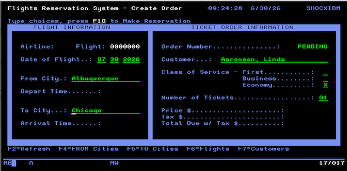
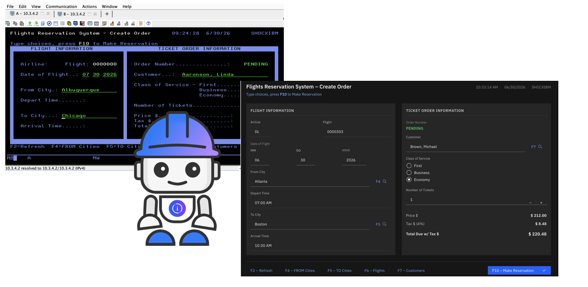
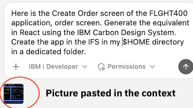
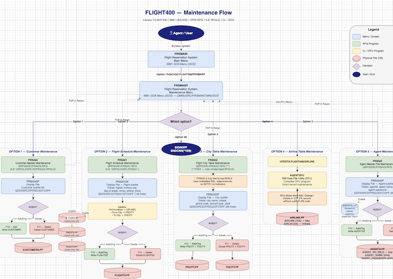

# FLIGHT400 Application — IBM i Modernization Lab Guide

> **Estimated time:** 2–3 hours  
> **Prerequisites:** IBM Bob IDE installed, internet access, IBM i TechZone LPAR (see below) , and the Premium Package for i 


 
---

## Part 0 — Environment Setup 

### How to Get an IBM i Virtual Machine (aka LPAR)

To complete this lab, you need access to an IBM i environment. You can provision a free IBM i LPAR through **IBM TechZone**.

1. Go to [https://techzone.ibm.com](https://techzone.ibm.com) and log in with your IBM ID.
2. Search for **"IBM i"** in the catalog, and select an **IBM i 7.6** environment (e.g. *IBM i 7.6 - Sandbox*).
3. Click **Reserve** and fill in the reservation form:
   - **Purpose:** Practice / Self-Education
   - **Duration:** choose at least 8 hours (extend later if needed)
   - **Geography:** pick the region closest to you
4. Submit the reservation. Within a few minutes you'll receive an email with your LPAR's **hostname**, **port**, **user profile**, and **password**.
5. Keep these credentials handy — you'll need them in the next step to connect Bob IDE to your IBM i.

> 💡 If you don't have an IBM ID, create one for free at [https://www.ibm.com/account](https://www.ibm.com/account).

---

### Install the Premium Package for i / IBM i Developer Pack for VS Code and Bob IDE

1. Open **Bob IDE**.
2. Go to the **Extensions** view (`Cmd+Shift+X` / `Ctrl+Shift+X`).
3. Search for **"Premium Package"** and install the **Premium Package for i** (publisher: *IBM*), that depends on extensions contained in the **IBM i Developer Pack** . This bundle includes:
   - **Code for IBM i** — source editing, object browser, IFS browser, Db2 for i extension etc. 
4. After installation, reload Bob IDE when prompted.
5. In the **Bob** extension settings (Activity sidebar), ensure the **Premium Package for i** is activated — this unlocks the IBM i Developer and IBM i Database modes used in later exercises.

---

### Restore the FLIGHT400 Application

In this section you will deploy the FLIGHT400 save file to your IBM i LPAR and restore the application library. Please Skip if Flight400 is already installed and go to the first Exercise.

#### 1.1 — Create a new local workspace

1. On your laptop, create an empty folder — for example `~/ibmi-lab`.
2. In Bob IDE go to **File → Open Folder** and open this new folder.
   Bob IDE will use this folder as your local workspace.
3. Download [`Install-Flight400.sql`](https://github.com/bmarolleau/flight400-demo/blob/main/Install-Flight400.sql) from this repository into that folder.

#### 1.2 — Download the save file into your workspace

From the [Box Folder](https://ibm.box.com/v/flight400-box), download **`FLGHT400.FILE`** into the folder you just opened.
This is an IBM i save file — a binary archive that contains the entire FLIGHT400 application (programs, source members, and database files), ready to be restored directly onto your LPAR.

Both files should now be visible in the IBM Bob IDE **Explorer** panel:

| File | Description |
|---|---|
| `FLGHT400.FILE` | IBM i save file containing the FLIGHT400 application |
| `Install-Flight400.sql` | SQL script that restores the application on IBM i |

#### 1.3 — Connect Bob IDE to your IBM i

1. In the Bob IDE Activity Bar, click the **IBM i** icon (plug icon).
2. Click **➕ New Connection** and enter the details from your TechZone reservation:
   - **IP/Host:** `<your-lpar-hostname>`
   - **Username:** `<your-user-profile>`
   - **Password:** `<your-password>`
   - **Private Key** If using PowerVS , let the **Password** field empty, download the private key, and set its path in this field.
3. Click **Connect**. A green status bar message confirms a successful connection.

#### 1.4 — Deploy the files to the IFS

1. In the Bob IDE **Explorer**, right-click on **`Install-Flight400.sql`**.
2. Choose **Deploy Selected Files**.  
   This uploads the entire workspace to an IFS directory on IBM i. The target IFS path is shown in the output panel — note it (e.g. `/home/YOURUSER/builds/ibmi-lab`).
3. In the Bob IDE **Explorer**, right-click on **`FLGHT400.FILE`**.
4. Choose **Deploy Selected Files**. 
   This uploads the entire workspace to an IFS directory on IBM i. The target IFS path is shown in the output panel — note it (e.g. `/home/YOURUSER/builds/ibmi-lab`).

> ☕ This may take a one minute or two, Perfect time for a coffee break! 
The Save File `FLGHT400.FILE` contains the code, programs, database files etc. Everything you need to run the application. 

#### 1.5 — Verify the upload in the IFS Browser

1. In the IBM i sidebar, expand **IFS Browser**.
2. Navigate to the upload directory noted above (e.g. `/home/YOURUSER/builds/ibmi-lab`).
3. You should see `FLGHT400.FILE` and `Install-Flight400.sql` listed.
4. Right-click on `FLGHT400.FILE` and choose **Copy Path**. It will look something like:  
   `/home/YOURUSER/builds/ibmi-lab/FLGHT400.FILE`

#### 1.6 — Update the SQL install script

1. Open `Install-Flight400.sql` in the Bob IDE editor.
2. Locate and update these variables at the top of the script:
   - **`v_ifs_path`** — set to the IFS path you just copied (e.g. `/home/YOURUSER/builds/ibmi-lab/FLIGHT74.FILE`)
   - **`v_rst_lib`** — target library name after restore (default: `FLGHT400`; change only if needed)
   - **`v_owner`** — *(optional)* owner profile for the restored library. Leave as `NULL` to use `CURRENT_USER` automatically, or set explicitly (e.g. `DEFAULT 'MYPROFILE'`) to override.

3. Save the file (`Ctrl+S` / `Cmd+S`).

#### 1.7 — Run the SQL script

1. In the **IFS Browser**, refresh the folder. You should see `Install-Flight400.sql` updated.
2. Right-click `Install-Flight400.sql` → **Run Action** → **Run SQL Statements**.
3. Wait for the script execute (create save file, restore library, update library ownership).  
   The output console will confirm each step. The final `RSTLIB` command restores the full **FLIGHT400** library including programs, source members, and database files.

> ✅ **End of Quick Setup.** The FLIGHT400 application is now restored on your IBM i in the `FLGHT400` library. 

> ✅ Make sure `FLGHT400`library is in your library list (in the Code for i settings). 

> ✅  If you have a 5250 terminal to your IBM i available, you can add the library to your lib list with `ADDLIBLE FLGHT400` if not already done, and launch the application from the CL (Green Screen) command prompt :  `GO FLGHT400/FRSMAIN` .

 > 💡 **Want to explore or troubleshoot the green-screen app?** See the [FLIGHT400 Quick Reference Guide](FLIGHT400-GUIDE.md) for navigation tips, menu structure, and common operations.

---

## Exercise 1 — Optional Warm-Up: Generate a React Carbon App from a Green Screen

**Goal:** Use Bob in **IBM i Developer** mode to analyze the FLIGHT400 *Create Order* 5250 screen and generate a modern React web application styled with the IBM Carbon Design System, running directly on IBM i PASE.



### Sharpen Your Skill 

Before generating the React app, give Bob some extra context about running React + Vite on IBM i PASE by creating a small helper Skill.

1. In Agent mode, click the **`+`** button (top right) and select **Local Workspace** as the task context.
2. Open [SAMPLE-SKILL.md](./SAMPLE-SKILL.md), copy its entire content, and paste it into the chat prompt.
3. Append the following instruction and send:

> *"Create a skill from the pasted text."*

### Expected Result

Bob creates a new Skill that improves its awareness of PASE-specific details for React and Vite projects. This lightweight Skill will be picked up automatically in the next step.

### Prompt in Bob Chat UI

- Switch to IBM i Developer mode, then Click on the `+` button (top right) and select  the `FLGHT400` (library list) as a context of for the task. Paste this [screenshot](./pics/flight400.png) in the prompt, and ask:

> *"Given this screenshot of the 5250 flight order screen from the Application Flight400 in @FLGHT400, Build a single-page React 18 + Vite 4 app on IBM i (PASE) using @carbon/react ^1.x with the g100 dark theme that modernises the IBM i 5250 screen shown in the attached screenshot. Create the app in the IFS at $HOME/flight400-frontend-apps/screen-name/.  Use dark theme, and list of values should  be proposed on each field.  Ensure that Node.js 22 is installed in PASE. "*



### Expected Result

Bob generates a full React application, including:
- Carbon components (`Tile`, `TextInput`, `RadioButtonGroup`, `Modal`, `Button`) mirroring the 5250 layout
- Selection modals replacing DDS subfile windows
- The RPG pricing formula ported to JavaScript
- pure JavaScript, no native binaries, running natively in IBM i PASE

Start the app from your IBM i PASE shell:

```bash
cd /home/<your-user>/flight400-react
npm run build   # compile
npm start       # serve on port 3001
```

Then open `http://<your-ibm-i-host>:3001` in your browser. Note that port number, and application look & feel can differ. 


### Skills & Tools Used Behind the Scene

In addition to the sample Skill we created in step 1, we've just used a set of unique Skills that are shipped with the Premium Package for i : 

| Tool / Skill | Role |
|---|---|
| `dds-primer-basics` skill | Parses `FRS001DF.DSPF` — screen layout, field names, subfile windows |
| `rpg-primer-basics` skill | Reads `FRS001.RPG` — extracts pricing logic and field definitions |
| IFS write tools | Creates project files directly in `$HOME/flight400-react/` on IBM i |
| IBM i PASE | Runs `npm install`, `npm run build`, `npm start` natively on IBM i |

> ⚠️ This app runs with sample data only. The natural next step is to add a REST / Web Services layer connecting the React front end to the real IBM i business logic and Db2 for i database.

---

## Exercise 2 — Code Explanation & Architecture Documentation

**Goal:** Use Bob's IBM i Developer mode to automatically generate an architecture overview with diagrams, then switch to Database mode to produce an Entity Relationship Diagram.

### 2a — Browse the Application in the Object Browser

1. In the IBM i sidebar, expand **User Library List** and **Object Browser**.
2. Add **FLGHT400** to your library list if not done, and add a filter to the **FLGHT400** library. Navigate to the **FLGHT400** library. You will see its contents organized by object type:
   - `*PGM` — RPG and CL programs (e.g. `FRS001`, `FRS021`, `FRS409`)
   - `*FILE` — Display files and database physical/logical files
   - `*MENU` — Application menus
3. Expand **Source Files** and browse `QRPGSRC` — open a couple of RPG programs to get a feel for the classic fixed-format style.
4. Navigate to **`QDDSSRCD`** and open the display file `FRS001DF`. In the editor, Click on **Preview All** on the first line of code. It renders the green-screen layout visually — notice the classic 5250 style.

> 💡 Try previewing `FRS021DF` as well — this is the **Flight Maintenance** screen you will work on later in Exercise 4.

> 💡 Again in the **Object Browser**, same library,  click on the program `FRS000.pgm`that is the flight reservation logon. You'll see in the `Detail` that this program was compiled in 1997, 30 years ago ! 


### 2b — Generate an Architecture Explanation with Bob

1. Click the **Open Bob** icon in the top right Activity Bar to open the chat panel.
2. If not already in **IBM i Developer** mode, switch to it using the mode selector at the top of the chat.
3. Click the **`+` (Scope) button** and add **QSYS Library List** as the context scope. This gives Bob visibility into the full application structure. Again, make sure that `FLGHT400` is in the library list. Bob will first search in this list before searching in all QSYS. 
4. Type the following prompt:

   > *"Generate a comprehensive architecture overview of the FLIGHT400 application in Markdown format. Include a high-level description, the main program flows, key programs and their roles, a Mermaid architecture diagram, and a summary of the database tables used."*

5. Bob will analyze the programs, source members, and database files and return a structured Markdown document. Review the output — notice how it identifies the menu-driven architecture, the core transaction programs, and the underlying database schema.
6. Copy the output to a new file `FLIGHT400-Architecture.md` in your workspace for reference.

### 2c — Generate an Entity Relationship Diagram (Database Mode)

1. In the Bob chat panel, switch to **IBM i Database** mode using the mode selector.
2. Type the following slash command:

   > `/erd FLGHT400`

3. Bob will introspect the physical files (`FLIGHTS`, `ORDERS`, `CUSTOMERS`, `AGENTS`, etc.) and their logical files, then generate a **Mermaid ERD** showing the relationships between entities.
4. Observe the key relationships:
   - `ORDERS` links to `FLIGHTS`, `CUSTOMERS`, and `AGENTS`
   - `FLIGHTS` references `FRCITY` and `TOCITY` for departure/arrival cities
5. Copy the ERD Markdown to your `FLIGHT400-Architecture.md` file.

> ✅ You now have a living architecture document generated entirely from the legacy codebase — no manual reverse-engineering required!

### 2d — *(Optional)* Generate a Draw.io Architecture Diagram

> **Prerequisite:** Install the **Draw.io Integration** extension in Bob IDE (`Cmd+Shift+X` → search *"Draw.io Integration"* → Install).

1. In the Bob chat panel (**IBM i Developer** mode), make sure the scope is set to **QSYS Library List**.
2. Type:

   > *"Analyze the FLIGHT400 application from the library list and generate a draw.io architecture diagram showing the main programs, menus, and database files. Save the file as `FLGHT400-architecture.drawio` in `$HOME/docs/` on IBM i."*

3. Bob introspects the library list, maps the program call graph and database relationships, and writes the `.drawio` XML file to `/home/<your-user>/docs/FLGHT400-architecture.drawio`.

4. In the **IFS Browser**, navigate to `$HOME/docs/` and click `FLGHT400-architecture.drawio` to open it — the Draw.io Integration extension renders the diagram directly in the editor.

> ✅ You now have a visual, editable architecture diagram of the legacy application — generated in seconds.


---

## Exercise 3 — Program-Level Explanation & Modernization

**Goal:** Understand an old OPM RPG program, then modernize it to free-format ILE RPG using the Bob modernization workflow.

### 3a — Understand FRS409 (Order Modification Confirmation)

1. Switch Bob back to **IBM i Developer** mode.
2. In the Object Browser, navigate to `FLGHT400/QRPGSRC` and open `FRS409`.
3. In the Bob chat panel, type:

   > *"What does this program do?"*

4. Bob will explain the program: `FRS409` is the **Order Modification Confirmation Window** — an OPM RPG program that displays a confirmation popup when a user modifies an order. It handles F3 (Exit), F12 (Cancel), and Enter key inputs via a `DOUEQ` loop with `CASEQ` dispatch subroutines, using a workstation data structure (`WSDS`) to capture the last key pressed.

### 3b — Modernize FRS409 Using the RPG Modernization Workflow

1. With `FRS409` still open in the editor, type in the Bob chat:

   > *"Can you modernize this program?"*

2. Bob recognizes the fixed-format OPM RPG code and offers to run the **RPG Modernization (Fixed to Free Format) workflow**. You can also choose between:
   - **Agentic mode** — Bob iterates and converts interactively (more flexible, takes longer)
   - **Workflow mode** — structured, guided steps (faster for well-known patterns)
   
   → Choose **Workflow mode** and click to start it.

3. The workflow form opens. Fill in the details:
   - **Source file:** `FLGHT400/QRPGSRC`
   - **Source member:** `FRS409` (Bob pre-fills this from the open editor)
   - Accept the other defaults and click **Analyze Member**.

Bob converts the fixed-format RPG to modern free-format ILE RPG.
runs the **Code for IBM i** compile action for ILE RPG, triggering a `CRTBNDRPG` command on your LPAR. Watch the output in the terminal panel. 
  ```
   > CRTBNDRPG PGM(FLGHT400/FRS409) SRCFILE(FLGHT400/QRPGSRC) SRCMBR(FRS409)
   Program FRS409 created in library FLGHT400.
   ```

4. Bob will also prompt: **"Confirm Output Member Location** — choose the suggested location. Bob will use all its RPG skills to modernize this source code. Approve the requested tasks.

**Program FLGHT400/FRS409 was created successfully (highest severity: 00).**

### 3c — Review the Modernization Summary

Bob automatically generates a **Modernization Summary Report** in Markdown. It includes:
- What was changed and why
- Lines of code before vs. after
- Opcode-by-opcode conversion notes
- Compilation result

Save this as `FRS409-Modernization-Report.md` in your workspace for documentation.

> ✅ You've just modernized a 30-year-old RPG program to modern free-format ILE RPG — with AI-assisted compilation — in minutes!

> ✅ At the Bottom of the Bob Chat Panel , Click on the 'File Changed' item, see `FRS409.RPGLE` diff. This resulting source is the new FRS409 ILE (RPGLE) program source deriving from the old `FRS409.RPG` OPM program. 

> ✅ In the Object Browser, check the new FRS409.PGM timestamp in `Detail` (right click on the file). Your new program is ready for further testing. 

---

## Exercise 4 — Field Expansion: Adding a New Field to a Screen

**Goal:** Add a new business field — *Total Flight Hours* — to the Flight Maintenance screen, then perform a full impact analysis and propagate the change end-to-end: display file, RPG programs, and the underlying database physical file. Every step is driven by a prompt to Bob.

### 4a — Explore the Flight Maintenance Screen

In the Bob chat panel (**IBM i Developer** mode), set the scope to **QSYS Library List** and type:

> *"Open the display file FRS021DF from FLGHT400/QDDSSRCD, show me its current screen layout using the DDS Previewer, and list all the fields currently defined on the Flight Maintenance screen."*

Bob opens `FRS021DF`, renders the DDS preview, and lists the existing fields:
- Flight Number, Day of the Week, From/To City
- Departure/Arrival Time
- Mileage, Airline, Seats Available, Ticket Price

---

### 4b — Add the New Field to the Display File

In the Bob chat panel, type:

> *"In the flight maintenance screen FRS021DF, add a new field SFLHRS for the total number of flight hours for the airplane (numeric, 4 digits). Place it after the Mileage field, with an appropriate label, COLHDG, and CHECK(RZ) keyword. Then compile the display file."*

Bob analyzes the DDS source, proposes the changes:
- A new field `SFLHRS` (4 digits, numeric, bound input/output)
- A matching label `'Flight Hours. . . . . . . . .'`
- Appropriate `COLHDG` and `CHECK(RZ)` keywords

Review the diff in the editor, accept and save. Bob then compiles:
```
CRTDSPF FILE(FLGHT400/FRS021DF) SRCFILE(FLGHT400/QDDSSRCD) SRCMBR(FRS021DF)
Display file FRS021DF created in library FLGHT400.
```

> ✅ The screen now declares `SFLHRS`. Next: find every object affected by this new field.

---

### 4c — Impact Analysis

Before touching any program or database file, ask Bob:

> *"Perform an impact analysis for adding a new field SFLHRS (Total Flight Hours, numeric 4 digits) to the FLIGHT400 application. Identify all RPG and CL programs that use the display file FRS021DF or the physical file FLIGHTS, any data structures or field lists that reference FLIGHTS fields, all logical files built over FLIGHTS, and the database physical file that needs the new column. Produce a summary table of what needs to change in each object."*

Bob queries the system catalog (`QSYS2.BOUND_MODULE_INFO`, `QSYS2.PROGRAM_INFO`, `QSYS2.SYSCOLUMNS`, `QSYS2.SYSKEYS`) and the Object Browser to produce an impact report. Expected output:

| Object | Type | Impact |
|---|---|---|
| `FLIGHTS` | `*FILE (PF)` | Add column `SFLHRS NUMERIC(4,0)` |
| `FRS021` | `*PGM (RPG)` | Add `SFLHRS` to data structure and screen I/O |
| `FRS021DF` | `*FILE (DSPF)` | Already updated in step 4b |
| `FRS001` | `*PGM (RPG)` | Read-only reference — verify no field list is affected |

Bob will also flag any logical files built over `FLIGHTS` that must be re-created after the physical file change.

> 💡 To dig deeper into database relations, ask Bob: *"Show me all database relations for the FLIGHTS file using DSPDBR."* Bob will run `DSPDBR FILE(FLGHT400/FLIGHTS)` and summarise the result.

---

### 4d — Add the Field to the Database Physical File

Ask Bob:

> *"Add the column SFLHRS (Total Flight Hours, numeric 4 digits, default 0) to the physical file FLIGHTS in library FLGHT400. Generate the ALTER TABLE statement, run it, and confirm the column was created by querying QSYS2.SYSCOLUMNS."*

Bob generates and runs:
```sql
ALTER TABLE FLGHT400.FLIGHTS
  ADD COLUMN SFLHRS NUMERIC(4, 0) DEFAULT 0;
```
Then immediately verifies by querying `QSYS2.SYSCOLUMNS` and confirms `SFLHRS` appears at the end of the column list.

> ✅ The database schema is extended. Existing rows carry the default value `0` until updated by the maintenance program.

---

### 4e — Propagate the Field to the RPG Programs

Ask Bob to update the main program:

> *"Open program FRS021 from FLGHT400/QRPGSRC. Update it to handle the new field SFLHRS (Total Flight Hours) that was added to both the display file FRS021DF and the physical file FLIGHTS: add SFLHRS to the FLIGHTS data structure, map it to the screen field, and include it in the READ/WRITE/UPDATE logic. Keep the existing style and structure of the program."*

Bob proposes changes:
- Adds `SFLHRS` to the `DFLIGHTS` data structure (or externally described `E DS`)
- Maps the screen field `SFLHRS` to the database field in the input/output cycle
- Includes `SFLHRS` in any `WRITE` or `UPDATE` opcode writing back to `FLIGHTS`

Review the diff, confirm, and save.

For any other programs flagged in the impact analysis, ask Bob individually:

> *"Does FRS001 need any changes to handle the new SFLHRS field in FLIGHTS? If yes, apply the minimal required changes."*

---

### 4f — Recompile and Validate

Ask Bob to recompile and validate everything in one prompt:

> *"Recompile FRS021 in FLGHT400, then validate the end-to-end change: confirm SFLHRS exists in the FLIGHTS table, that FRS021 compiled successfully, and that the field appears correctly on the FRS021DF screen preview."*

Bob will:
1. Trigger the compile:
   ```
   CRTBNDRPG PGM(FLGHT400/FRS021) SRCFILE(FLGHT400/QRPGSRC) SRCMBR(FRS021)
   Program FRS021 created in library FLGHT400.
   ```
2. Query `QSYS2.SYSCOLUMNS` to confirm `SFLHRS` exists in `FLIGHTS`
3. Check the `FRS021.PGM` compile timestamp in the Object Browser
4. Preview `FRS021DF` with the DDS Previewer to show `SFLHRS` on screen

> 💡 *(Optional)* To see the new field live in a 5250 session, ask Bob: *"Run the Flight Maintenance program FRS021 in FLGHT400 via a CALL command."*

> ✅ End-to-end field expansion complete — `SFLHRS` is now in the database, on the screen, and handled by the RPG program. Full change cycle driven entirely by Bob: DDS → Impact Analysis → Database DDL → RPG → Compile → Validate.

---

## Exercise 5 — Database Optimization

**Goal:** Review a complex SQL query written by a junior developer, validate it, and apply Bob's index advisor to improve performance.

### 5a — Switch to IBM i Database Mode

In the Bob chat panel, use the mode selector to switch to **IBM i Database** mode.

### 5b — Review the Query with Bob

A junior developer wrote the following query to summarize flight bookings per flight per agent. Copy it into the Bob chat using the `/review` slash command:

```sql
/review
-- ============================================================
-- Flight Booking Summary — Per Flight, Per Agent
-- Shows: route details, airline, agent, ticket counts,
--        class breakdown, and ticket price
-- ============================================================
SELECT
    f.FLIGH00001                                    AS FLIGHT_NUMBER,
    f.DEPARTURE                                     AS FROM_CITY,
    f.ARRIVAL                                       AS TO_CITY,
    f.AIRLINES                                      AS AIRLINE,
    f.DAY_O00001                                    AS DAY_OF_WEEK,
    f.DEPAR00002                                    AS DEPARTURE_TIME,
    f.ARRIV00002                                    AS ARRIVAL_TIME,
    f.MILEAGE,
    f.TICKE00001                                    AS TICKET_PRICE,
    f.SEATS00001                                    AS SEATS_AVAILABLE,

    ag.AGENT_NAME,

    COUNT(DISTINCT o.CUSTO00001)                    AS UNIQUE_CUSTOMERS,
    SUM(o.TICKE00001)                               AS TOTAL_TICKETS_SOLD,

    SUM(CASE WHEN o.CLASS = 'F' THEN o.TICKE00001 ELSE 0 END) AS FIRST_CLASS_TICKETS,
    SUM(CASE WHEN o.CLASS = 'B' THEN o.TICKE00001 ELSE 0 END) AS BUSINESS_TICKETS,
    SUM(CASE WHEN o.CLASS = 'E' THEN o.TICKE00001 ELSE 0 END) AS ECONOMY_TICKETS,

    MIN(o.DEPAR00001)                               AS EARLIEST_BOOKING_DATE,
    MAX(o.DEPAR00001)                               AS LATEST_BOOKING_DATE

FROM FLGHT400/FLIGHTS       f
JOIN FLGHT400/ORDERS        o  ON o.FLIGH00001  = f.FLIGH00001
JOIN FLGHT400/AGENTS        ag ON ag.AGENT_NO   = o.AGENT_NO
LEFT JOIN FLGHT400/CUSTOMERS c  ON c.CUSTO00001  = o.CUSTO00001

WHERE o.DEPAR00001 >= CURRENT TIMESTAMP

GROUP BY
    f.FLIGH00001,
    f.DEPARTURE,
    f.ARRIVAL,
    f.AIRLINES,
    f.DAY_O00001,
    f.DEPAR00002,
    f.ARRIV00002,
    f.MILEAGE,
    f.TICKE00001,
    f.SEATS00001,
    ag.AGENT_NAME

ORDER BY
    o.DEPAR00001,
    f.FLIGH00001

FETCH FIRST 100 ROWS ONLY;
```

Bob will review the query and flag several observations, for example:
- ⚠️ The `ORDER BY o.DEPAR00001` references a non-grouped, non-aggregated column — this may cause unexpected ordering or an error in strict SQL mode
- ⚠️ The `LEFT JOIN` on `CUSTOMERS` is declared but `c.*` columns are never selected — it is unused and adds unnecessary overhead
- ✅ The `CASE`-based class breakdown is correct
- ✅ `FETCH FIRST 100 ROWS ONLY` is good practice for large datasets
- 💡 Suggestion: use column aliases in the `GROUP BY` for readability (DB2 for i supports this)

### 5c — Run the Index Advisor

Still in IBM i Database mode, ask Bob:

> *"Can you run the index advisor for this query and suggest what indexes should be created to improve its performance?"*

Bob will:
1. Submit the query to the **Db2 for i Index Advisor** (via the `SYSDUMMY1` virtual table and Index Advisor services)
2. Analyze the query access plan
3. Recommend indexes, for example:
   - An index on `ORDERS(FLIGH00001, DEPAR00001)` to optimize the join and `WHERE` filter
   - An index on `ORDERS(AGENT_NO)` to speed up the join to `AGENTS`
4. Optionally generate the `CREATE INDEX` DDL statements for you to review and apply

> ✅ You've validated, improved, and optimized a SQL query — without needing to be a Db2 expert!

### 5d — Run the Index Advisor Workflow (Dynamic Analysis)

Still in IBM i Database mode, use the **Index Advisor** workflow. In the Bob chat panel, open the workflow picker and select **Index Advisor**, then paste the query from 5b when prompted.

Bob will:
1. Use or capture new performance data. `DUMP PLAN CACHE`, `DBMON`, `DUMP PLAN CACHE TOPN`. 
2. Parse the advisor output and identify recommended indexes
3. Generate the `CREATE INDEX` DDL statements for you to review and apply

> ✅ You've validated, improved, and optimized a SQL query using a guided workflow — without needing to be a Db2 expert!

---

## Exercise 6 — Ask Bob About Your System

**Goal:** Use Bob in IBM i Developer mode to answer system-level questions using two natural language prompts.

Switch back to **IBM i Developer** mode and try these prompts:

**Prompt 1:**
> *"What jobs are currently active on the system and which ones are consuming the most CPU?"*

**Prompt 2:**
> *"From this list, select the job consuming the most CPU, check the job log, and suggest ways to improve it.*

Bob will query the system performance views (e.g. `QSYS2.ACTIVE_JOB_INFO`) and return a summary of active jobs with CPU utilization — giving you an instant health check on your LPAR, then use other tools to read the logs and other information, and create a first report.

**Prompt 3:**
> *"Which programs in the FLGHT400 library have not been recompiled in the last 5 years?"*

Bob will query `QSYS2.OBJECT_STATISTICS` filtering on object type `*PGM` in `FLGHT400`, compare the `LAST_USED_TIMESTAMP` or `OBJCREATED` attributes, and list the stale programs — perfect input for a modernization backlog.

---

## Summary

Congratulations! In this lab you:

| Exercise | What You Did |
|---|---|
| **Setup** | Restored the FLIGHT400 application onto IBM i from a save file |
| **Exercise 1** | Optional: UI modernization, 5250 to React |
| **Exercise 2** | Generated architecture docs and an ERD with Bob |
| **Exercise 3** | Explained and modernized OPM RPG `FRS409` to free-format ILE RPG |
| **Exercise 4** | Added a new field to a 5250 display file with Bob's help |
| **Exercise 5** | Reviewed and optimized a SQL query using Bob's database tools |
| **Exercise 6** | Queried your IBM i system using natural language |

> **Next steps:** Explore connecting the React app to live IBM i data via a Node.js or Java REST API, or dive deeper into the RPG modernization workflow for the other FLIGHT400 programs.
