# FLIGHT400 Application — IBM i Modernization Lab Guide

> **🎓 Running a Bobathon?** Use the GitHub Pages–hosted version of this guide instead of this README — it provides a polished, event-specific experience for participants. See the [GitHub Pages Instructor Guide](instructor-setup/Github-Pages-Instructor-Guide.md) for how to set that up.

> **Estimated time:** 2–3 hours
> **Prerequisites:** IBM Bob IDE installed, internet access, IBM i TechZone LPAR (see below), and the Premium Package for i

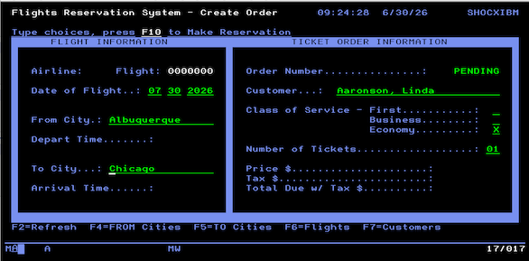

---

## Part 0 — Environment Setup

#### Note: Instructors need to complete steps laid out in the [Instructor Setup README](instructor-setup/README.md)

Complete all steps below before starting any exercise. Start by installing and logging in to Bob, then verify your extensions, find your library number, and finally connect to IBM i.

---

### Step 1 — Pre-Requisite Bob Setup

Check your inbox for the **"You've been invited to join your team"** email, then follow these steps to install Bob and sign in for the first time.

1. **Create your IBM ID** — Open the invitation email and click the link to create your IBM ID. This gives you an account to access IBM Bob.

2. **Download & open Bob** — Download Bob using the correct installer for your computer, then open it. If Bob asks whether to import settings from another editor, click your regular IDE or **Skip for now**. If it asks about chat migration, click **Skip migration**.

3. **Log in to Bob** — In the Bob chat window, click **Log in to Bob**. When asked to allow Bob to sign in, click **Allow**. Bob will then ask if you want to open a link — click **Open**. This opens your browser to complete the sign-in.

4. **Verify you're on the correct team** — Click the **gear icon** above the Bob chat window. Under **General** settings, you'll see a team selector. Make sure it shows a team with **Bobathon** in the name. If not, click it and select the Bobathon account from the list.

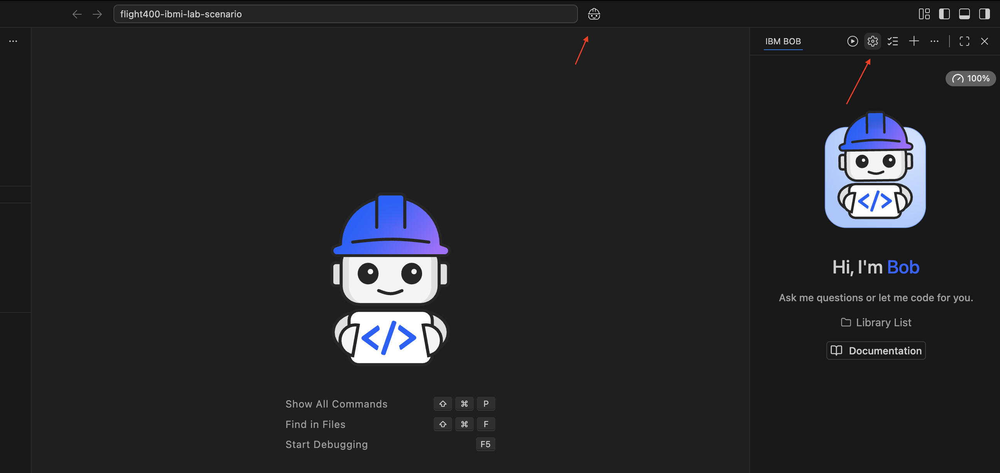
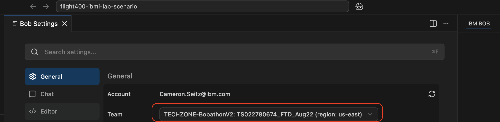

---

### Step 2 — Verify and Install Required Extensions

Two extensions are required. The **IBM Bob Premium Package for i** is often pre-installed for your team — verify it below. The **IBM i Development Pack** must be installed manually.

1. Open the Extensions view: press `Cmd+Shift+X` (macOS) or `Ctrl+Shift+X` (Windows/Linux).

2. **Verify IBM Bob Premium Package for i** — Search for `"IBM Bob Premium"`. If **IBM Bob Premium Package for i** (publisher: IBM) appears under *Installed*, you're all set — skip to step 3. If it is not installed, click **Install** now. This package includes Code for IBM i (source editing, object browser, IFS browser, Db2 for i, and more).

3. **Confirm it is activated in Bob** — In the Bob Activity sidebar, open the Bob extension settings and verify **IBM Bob Premium Package for i** is activated. If you just installed it, reload Bob when prompted first. Activation unlocks the IBM i Developer and IBM i Database modes.

4. **Install IBM i Development Pack** — Search for `"IBM i Development Pack"` in the Extensions panel. This extension is **not** pre-installed — click **Install** if it does not appear under *Installed*. Reload Bob if prompted.

---

### Step 3 — Find Your Assigned Library Number

Your instructor will assign you a library number. Each participant has their own copy of the FLIGHT400 application in a library named **FLGHT4nn** (e.g. FLGHT401, FLGHT402). **Use only your assigned number throughout all exercises so everyone can work independently.**

| Student # | Library | Dev Port | React App URL |
|:---------:|---------|:--------:|---------------|
| 1  | `FLGHT401` | 3001 | `http://localhost:3001` |
| 2  | `FLGHT402` | 3002 | `http://localhost:3002` |
| 3  | `FLGHT403` | 3003 | `http://localhost:3003` |
| 4  | `FLGHT404` | 3004 | `http://localhost:3004` |
| 5  | `FLGHT405` | 3005 | `http://localhost:3005` |
| 6  | `FLGHT406` | 3006 | `http://localhost:3006` |
| 7  | `FLGHT407` | 3007 | `http://localhost:3007` |
| 8  | `FLGHT408` | 3008 | `http://localhost:3008` |
| 9  | `FLGHT409` | 3009 | `http://localhost:3009` |
| 10 | `FLGHT410` | 3010 | `http://localhost:3010` |
| 11 | `FLGHT411` | 3011 | `http://localhost:3011` |
| 12 | `FLGHT412` | 3012 | `http://localhost:3012` |
| 13 | `FLGHT413` | 3013 | `http://localhost:3013` |
| 14 | `FLGHT414` | 3014 | `http://localhost:3014` |
| 15 | `FLGHT415` | 3015 | `http://localhost:3015` |
| 16 | `FLGHT416` | 3016 | `http://localhost:3016` |
| 17 | `FLGHT417` | 3017 | `http://localhost:3017` |
| 18 | `FLGHT418` | 3018 | `http://localhost:3018` |
| 19 | `FLGHT419` | 3019 | `http://localhost:3019` |
| 20 | `FLGHT420` | 3020 | `http://localhost:3020` |
| 21 | `FLGHT421` | 3021 | `http://localhost:3021` |
| 22 | `FLGHT422` | 3022 | `http://localhost:3022` |
| 23 | `FLGHT423` | 3023 | `http://localhost:3023` |
| 24 | `FLGHT424` | 3024 | `http://localhost:3024` |
| 25 | `FLGHT425` | 3025 | `http://localhost:3025` |
| 26 | `FLGHT426` | 3026 | `http://localhost:3026` |
| 27 | `FLGHT427` | 3027 | `http://localhost:3027` |
| 28 | `FLGHT428` | 3028 | `http://localhost:3028` |
| 29 | `FLGHT429` | 3029 | `http://localhost:3029` |
| 30 | `FLGHT430` | 3030 | `http://localhost:3030` |
| 31 | `FLGHT431` | 3031 | `http://localhost:3031` |
| 32 | `FLGHT432` | 3032 | `http://localhost:3032` |
| 33 | `FLGHT433` | 3033 | `http://localhost:3033` |
| 34 | `FLGHT434` | 3034 | `http://localhost:3034` |
| 35 | `FLGHT435` | 3035 | `http://localhost:3035` |
| 36 | `FLGHT436` | 3036 | `http://localhost:3036` |
| 37 | `FLGHT437` | 3037 | `http://localhost:3037` |
| 38 | `FLGHT438` | 3038 | `http://localhost:3038` |
| 39 | `FLGHT439` | 3039 | `http://localhost:3039` |
| 40 | `FLGHT440` | 3040 | `http://localhost:3040` |
| 41 | `FLGHT441` | 3041 | `http://localhost:3041` |
| 42 | `FLGHT442` | 3042 | `http://localhost:3042` |
| 43 | `FLGHT443` | 3043 | `http://localhost:3043` |
| 44 | `FLGHT444` | 3044 | `http://localhost:3044` |
| 45 | `FLGHT445` | 3045 | `http://localhost:3045` |
| 46 | `FLGHT446` | 3046 | `http://localhost:3046` |
| 47 | `FLGHT447` | 3047 | `http://localhost:3047` |
| 48 | `FLGHT448` | 3048 | `http://localhost:3048` |
| 49 | `FLGHT449` | 3049 | `http://localhost:3049` |
| 50 | `FLGHT450` | 3050 | `http://localhost:3050` |

> 💡 The **Dev Port** is only needed for **Exercise 7**. When Bob asks you to pin your Vite dev server to a port, use the value from the Dev Port column. Your React app will be reachable at the React App URL shown — provided your SSH tunnel (Step 5) is active.

> ✅ If you have a 5250 terminal, you can also add the library with `ADDLIBLE FLGHT4nn` and launch the app with `GO FLGHT4nn/FRSMAIN`.

> 💡 **Want to explore or troubleshoot the green-screen app?** See the [FLIGHT400 Quick Reference Guide](FLIGHT400-GUIDE.md) for navigation tips, menu structure, and common operations.

---

### Step 4 — Connect Bob IDE to IBM i

1. **Open the IBM i panel in Bob IDE** — Click the IBM i icon in the left Activity Bar.

2. **Add a new connection** — Click **New Connection** and enter the host IP, user profile, and `ssh_private_key` provided by your instructor. **Do not use the password here — use only the `ssh_private_key`.**

   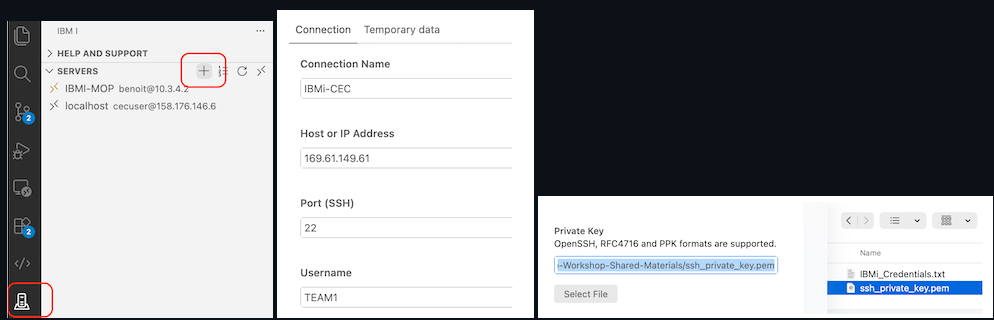

3. **Add your assigned library to the User Library List** — In the Code for IBM i extension, navigate to the **User Library List** section and click the **+** icon. Type `FLGHT4nn` (replace `nn` with your assigned number) and press **Enter**.

   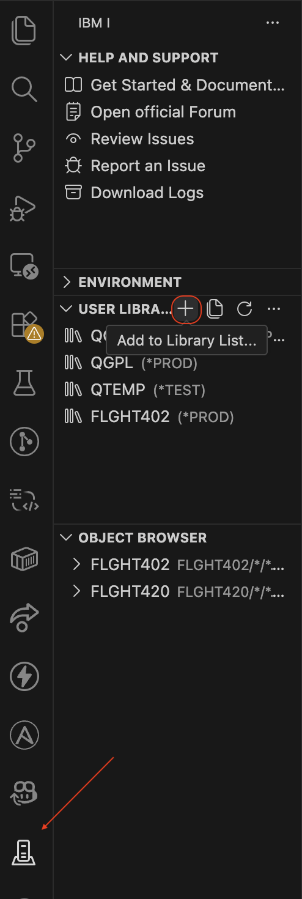
   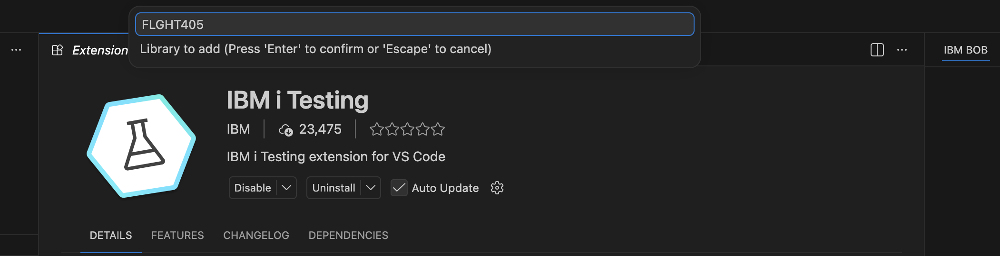

   > ✅ If you have a 5250 terminal, you can also run: `ADDLIBLE FLGHT4nn`

4. **Add your assigned library to the Object Browser** — Go to the **Object Browser** section and click the funnel icon or **Create new filter**. Name your filter, set **Libraries** to `FLGHT4nn`, and set **Object types** to `*ALL` to see all types: `*PGM` (RPG and CL programs), `*FILE` (display and database files), `*MENU` (application menus). Click **Save Settings**.
> **📝 Note:** Replace `nn` in `FLGHT4nn` with your team number (e.g. `FLGHT401`, `FLGHT402`…). If you are working alone on the system, use `FLGHT400`.

   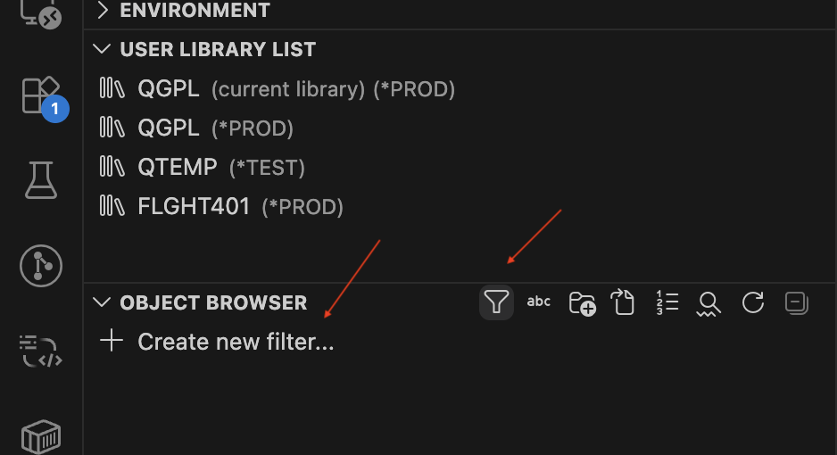
   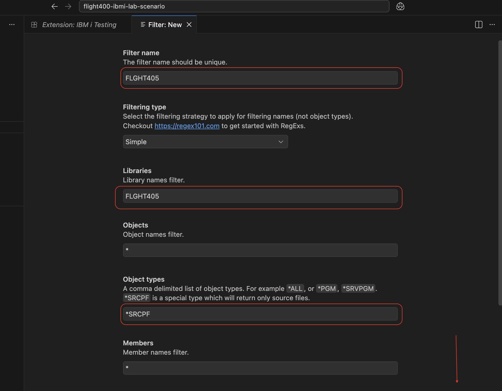

5. **Set the workspace to Library List** — Click the **+** icon above the Bob chat window. When the options appear, make sure your library is listed under **New Task in Library List** and select that option.

   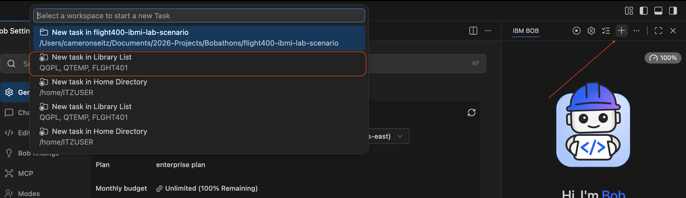

---

### Step 5 — SSH Tunnel (For Green Screen and Exercise 7)

Your instructor will give you the host IP address, user profile, and password for your IBM i environment.

1. **Download the private key from TechZone** and set its permissions:

```bash
chmod 600 ssh_private_key.pem
```

2. **Open the SSH tunnel** — Run the command below on your laptop. Replace `<myuser>@<myIPaddress>` with the values from your TechZone reservation. On macOS/Linux you may need `sudo ssh`. On Windows, remove `sudo` and run as Administrator.

   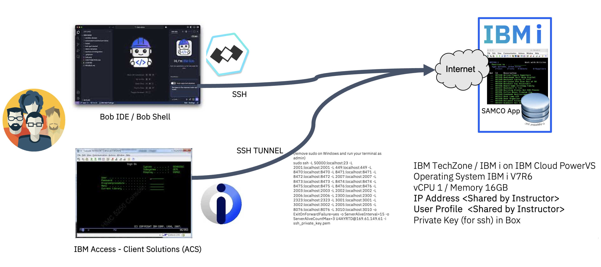

```bash
sudo ssh -L 50000:localhost:23 -L 2001:localhost:2001 -L 449:localhost:449 -L 8470:localhost:8470 -L 8471:localhost:8471 -L 8472:localhost:8472 -L 2007:localhost:2007 -L 8473:localhost:8473 -L 8474:localhost:8474 -L 8475:localhost:8475 -L 8476:localhost:8476 -L 2003:localhost:2003 -L 2002:localhost:2002 -L 2006:localhost:2006 -L 2300:localhost:2300 -L 2323:localhost:2323 -L 2005:localhost:2005 -L 8076:localhost:8076 -L 3001:localhost:3001 -L 3002:localhost:3002 -L 3003:localhost:3003 -L 3004:localhost:3004 -L 3005:localhost:3005 -L 3006:localhost:3006 -L 3007:localhost:3007 -L 3008:localhost:3008 -L 3009:localhost:3009 -L 3010:localhost:3010 -L 3011:localhost:3011 -L 3012:localhost:3012 -L 3013:localhost:3013 -L 3014:localhost:3014 -L 3015:localhost:3015 -L 3016:localhost:3016 -L 3017:localhost:3017 -L 3018:localhost:3018 -L 3019:localhost:3019 -L 3020:localhost:3020 -L 3021:localhost:3021 -L 3022:localhost:3022 -L 3023:localhost:3023 -L 3024:localhost:3024 -L 3025:localhost:3025 -L 3026:localhost:3026 -L 3027:localhost:3027 -L 3028:localhost:3028 -L 3029:localhost:3029 -L 3030:localhost:3030 -L 3031:localhost:3031 -L 3032:localhost:3032 -L 3033:localhost:3033 -L 3034:localhost:3034 -L 3035:localhost:3035 -L 3036:localhost:3036 -L 3037:localhost:3037 -L 3038:localhost:3038 -L 3039:localhost:3039 -L 3040:localhost:3040 -L 3041:localhost:3041 -L 3042:localhost:3042 -L 3043:localhost:3043 -L 3044:localhost:3044 -L 3045:localhost:3045 -L 3046:localhost:3046 -L 3047:localhost:3047 -L 3048:localhost:3048 -L 3049:localhost:3049 -L 3050:localhost:3050 -o ExitOnForwardFailure=yes -o ServerAliveInterval=15 -o ServerAliveCountMax=3 <myuser>@<myIPaddress> -i ssh_private_key.pem
```

> 💡 If you don't have an IBM ID, create one for free at [https://www.ibm.com/account](https://www.ibm.com/account).

> 💡 For 5250 or Database access, install [IBM i Access Client Solutions](https://www.ibm.com/support/pages/ibm-i-access-client-solutions).

3. **(Optional) Connect IBM i Access Client Solutions for 5250** — Only needed if you want to view the green screen. Install [IBM i Access Client Solutions](https://www.ibm.com/support/pages/ibm-i-access-client-solutions) and make sure the SSH tunnel from step 2 is running. Open the 5250 Emulator, set IP Address to `127.0.0.1` and port to `50000`. If it tries port 23, override it in Communication → Configure → Destination Port: `50000`. Log in with your username and password, then:

```bash
ADDLIBLE FLGHT4nn
CALL FLGHT4nn/FRS021
```

   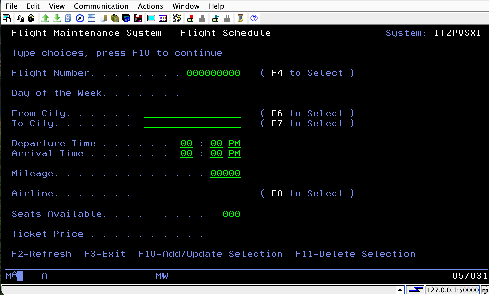

   > ⚠️ When finished, exit the 5250 screen by pressing **F3**.

---

## Exercise 1 — Code Explanation & Architecture Documentation

**Goal:** Use Bob's IBM i Developer mode to automatically generate an architecture overview with diagrams, then switch to Database mode to produce an Entity Relationship Diagram. This exercise takes about 30 minutes to complete.

### 1a — Browse the Application in the Object Browser

1. In the IBM i sidebar, expand **User Library List** and **Object Browser**.
2. Add a filter for `FLGHT4nn` in the Object Browser if not already done, and set Object types to `*ALL` so you see: `*PGM` (RPG and CL programs), `*FILE` (display and database files), `*MENU` (application menus).
3. Expand **Source Files** and open a few programs from `QRPGSRC` to get a feel for the classic fixed-format style.
4. Navigate to `QDDSSRCD` and open `FRS001DF`. Click **Preview All** on the first line to see the green-screen layout rendered visually.

   > 💡 Try previewing `FRS021DF` as well — this is the **Flight Maintenance** screen used in Exercise 3.

5. In the Object Browser, click `FRS000.pgm` — the flight reservation logon. Check its **Detail**: it was compiled in 1997, over 30 years ago!

### 1b — Generate an Architecture Explanation with Bob

1. Switch to **IBM i Developer** mode. Click the **+ (Scope) button** and select **(QSYS) Library List** as the context scope. Make sure `FLGHT4nn` is in the library list.
2. Replace `nn` with your library number and type:

   > *"Generate a comprehensive architecture overview of the FLGHT4nn application in QSYS in Markdown format. Include a high-level description, the main program flows, key programs and their roles, a Mermaid architecture diagram, and a summary of the database tables used."*

3. Bob will analyze the programs, source members, and database files and return a structured Markdown document. Review the output — notice how it identifies the menu-driven architecture, the core transaction programs, and the underlying database schema.

   > 💡 Copy the output to a new file `FLGHT4nn-Architecture.md` in your workspace for reference.

### 1c — Generate an Entity Relationship Diagram

1. Switch to **IBM i Database** mode using the mode selector. Type the slash command so `/erd` is highlighted in the Bob chat. Replace `4nn` with your number:

   > `/erd FLGHT4nn`

2. Bob will introspect the physical files (`FLIGHTS`, `ORDERS`, `CUSTOMERS`, `AGENTS`, etc.) and generate a Mermaid ERD. Key relationships: `ORDERS` links to `FLIGHTS`, `CUSTOMERS`, and `AGENTS`; `FLIGHTS` references `FRCITY` and `TOCITY`. Copy the ERD to your architecture document.

> ✅ You now have a living architecture document generated entirely from the legacy codebase — no manual reverse-engineering required!

### 1d — *(Optional)* Generate a Draw.io Architecture Diagram

> **Prerequisite:** Install the **Draw.io Integration** extension (`Cmd+Shift+X` → search *"Draw.io Integration"* → Install).

In IBM i Developer mode with Library List scope, replace `4nn` with your number:

> *"Analyze the FLGHT4nn application from the library list and generate a draw.io architecture diagram showing the main programs, menus, and database files. Save the file as `FLGHT4nn-architecture.drawio` in `$HOME/docs/` on IBM i."*

In the **IFS Browser**, navigate to `$HOME/docs/` and click the `.drawio` file to open it — the Draw.io Integration extension renders the diagram directly in the editor.


### 1e — *(Optional)* Business Rules Extraction

Drill down on a specific member using the Business Rules Extraction workflow. Click the **workflow icon** at the top of the Bob panel, choose to run the workflow in your library list, and select **Business Rules Extraction**.


When prompted, use the following selections:

| Option | Value |
|---|---|
| Library | `FLGHT4nn` |
| Source File | `QRPGLESRC` |
| Member | `FRS401.RPGLE` |

Watch Bob create a guided workflow and generate a complete report describing a business function — business rules, decision logic, Mermaid diagrams, process flows, and more. Documentation is written in business-friendly language, not technical jargon.

At the end, specify an output path unique to your library number, e.g. `/home/ITZUSER/flght4nn/docs/business-rules/FRS401-report.md`.


---

## Exercise 2 — Program-Level Explanation & Modernization

**Goal:** Understand an old OPM RPG program, then modernize it to free-format ILE RPG using the Bob modernization workflow. This exercise takes about 15 minutes to complete.

### 2a — Understand FRS409 (Order Modification Confirmation)

1. Switch Bob to **IBM i Developer** mode.
2. In the Object Browser, navigate to `FLGHT4nn/QRPGSRC` and open `FRS409`.
3. With `FRS409` open in the editor, type in the Bob chat:

   > *"What does this program do?"*

4. Bob will explain that `FRS409` is the **Order Modification Confirmation Window** — an OPM RPG program that displays a confirmation popup when a user modifies an order. It handles F3 (Exit), F12 (Cancel), and Enter key inputs via a `DOUEQ` loop with `CASEQ` dispatch subroutines.

### 2b — Modernize FRS409 Using the RPG Modernization Workflow

1. With `FRS409` still open in the editor, type in the Bob chat:

   > *"Can you modernize this program?"*

2. Bob recognizes the fixed-format OPM RPG code and offers to run the **RPG Modernization (Fixed to Free Format)** workflow. Choose **Start workflow**.

3. The workflow form opens. Fill in the details:
   - **Source file:** `FLGHT4nn/QRPGSRC`
   - **Source member:** `FRS409` (Bob pre-fills from the open editor)
   - Accept the other defaults and click **Analyze Member**.

   Bob spins up a subagent to convert the fixed-format RPG to modern free-format ILE RPG, then runs the Code for IBM i compile action for ILE RPG, triggering a `CRTBNDRPG` command on your LPAR. Watch the output in the terminal panel.

4. When Bob prompts **"Confirm Output Member Location"**, ensure the path contains your library number. Approve the requested tasks. Bob will place the modernized source at `FLGHT4nn/QRPGLESRC/FRS409.RPGLE`.

### 2c — Review the Modernization Summary

Bob automatically generates a **Modernization Summary Report** in the chat, including:
- What was changed and why
- Lines of code before vs. after
- Opcode-by-opcode conversion notes
- Compilation result

> ✅ At the bottom of the Bob chat panel, click the **File Changed** item to see the diff for `FRS409.RPGLE`. In the Object Browser, right-click `FRS409.PGM` → **Detail** to check the new compile timestamp. You can copy the report to `FRS409-Modernization-Report.md` in your workspace.

---

## Exercise 3 — Field Expansion: Add Total Flight Hours

**Goal:** Use Bob's IBM i Developer mode to plan the change first, then implement it — adding a new business field, *Total Flight Hours*, from the physical file all the way to the 5250 screen. This exercise takes about 30 minutes to complete.

The completed field will use the following names:

| Layer | Field Name | Definition |
|---|---|---|
| Database (PF) | `FLHRS` | 4P 0 (packed, 4 digits, 0 decimals) |
| Logical / RPG | `FHRS` | `RENAME(FLHRS)` |
| Screen (DDS) | `SFLHRS` | 4/0, input/output, after Mileage |

**Before you begin:** In the Bob chat panel, select **IBM i Developer** mode, set scope to **Library List (QSYS)**, and confirm `FLGHT4nn` is on the library list. You stay in Developer mode for the whole exercise.

---

### 3a — Create a Custom Rule for Bob

Custom rules allow you to add personalized or organization-specific instructions to Bob's context window. Rather than pasting standing rules into chat every session, you can bake them permanently into the **IBM i Developer** mode so Bob always follows them. Follow these steps to add the rules through the UI.

1. Click the **settings icon** at the top right of the Bob panel.

   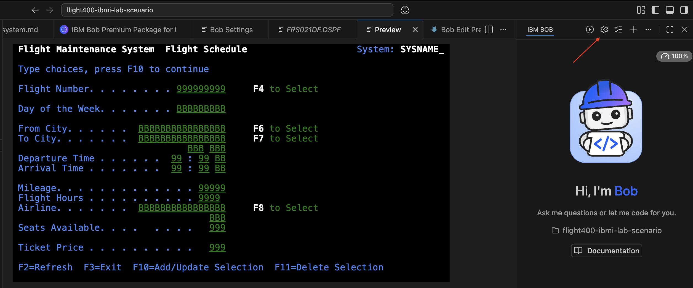

2. Click **Modes** on the left sidebar, then select **IBM i Developer**.

   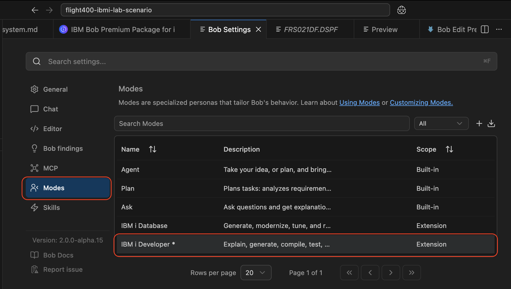

3. Click the **pencil (edit) icon** in the top right to open the mode editor.

   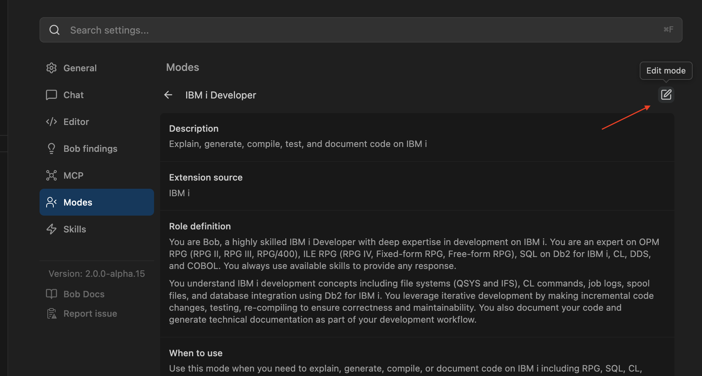

4. Scroll down to the **Custom Instructions** section and add the following prompt beneath the Interaction Guidelines. Then click **Save**.

   ```
   ## When a user asks to plan or implement code changes
   - Make insert-only changes using apply_diff with surrounding context; do not use insert_content.
   - When inserting, anchor the diff on the line ABOVE the insertion point and do not include trailing structural lines (DDS key "K ..." or record-format "R ..." lines) in the replacement - leave those lines untouched.
   - When adding a fixed-form entry that mirrors an existing one (RPG I-spec, O-spec, or DDS field), copy the model line's EXACT column positions and change only the field name and value. Re-pad so numbers stay right-justified in their original columns and the data-type letter stays in its column. If the new field name is a different length than the model, adjust the padding so every downstream column is unchanged. Never eyeball the spacing.
   - Preserve exact DDS column positions for field-definition entries (name, length, type). Keyword continuation lines like COLHDG only need to start after position 44 - do not fixate on their exact alignment.
   - Preserve the existing OPM RPG fixed-column style.
   - Do not add ALWNULL, do not use SQL ALTER TABLE, do not change the field to 5P 1.
   - COLHDG belongs only in the physical file, never in the display file.
   - Always show the diff and wait for my approval before saving; never compile until I say so.
   ```

   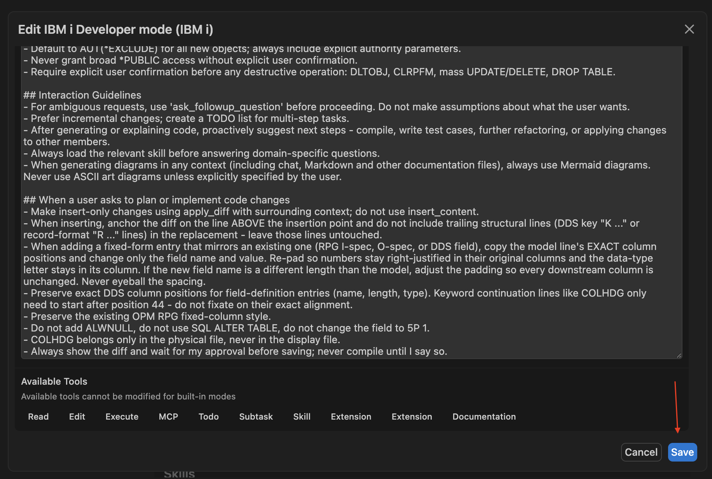

> ✅ Bob will now apply these rules automatically whenever **IBM i Developer** mode is used — no need to paste them at the start of each session.

---

### 3b — Explore the Flight Maintenance Screen

```
Preview the display file FRS021DF from FLGHT4nn/QDDSSRCD and list every field on the Flight Maintenance screen, noting the input/output type of each and the screen-field naming convention (e.g. SFLGHT, SMILES, SSEATS, SPRICE). Do not modify anything.
```

Bob should preview the screen and list fields such as Flight Number, From/To City, Departure/Arrival Time, Mileage, Seats Available, and Ticket Price — and identify the `S`-prefix naming pattern (`SFLGHT`, `SMILES`, `SSEATS`, `SPRICE`).

**Optional — see it live in a 5250 emulator:** With the SSH tunnel from Step 5 running, open IBM i Access Client Solutions and connect, then:

```bash
ADDLIBLE FLGHT4nn
CALL FLGHT4nn/FRS021
```


> ⚠️ Exit the 5250 screen with **F3** before continuing.

---

### 3c — Plan the Change

Here you ask Bob to plan the change *with* you first — reasoning through a step-by-step plan *without* writing, editing, saving, or compiling anything. This single prompt carries the full spec, and the execution steps that follow just reference the approved plan.

| Attribute | Value |
|---|---|
| Business meaning | Total Flight Hours |
| Database field | `FLHRS` — 4P 0 |
| Logical / RPG field | `FHRS RENAME(FLHRS)` |
| Screen field | `SFLHRS` — 4/0, input/output |
| Screen placement | Immediately after Mileage |
| Valid range | 0–9999 |

```
Let's plan this change together first — do not write, edit, save, or compile any code; just produce the plan with me. Produce a step-by-step implementation plan to add "Total Flight Hours" to the Flight Maintenance application in FLGHT4nn.

Spec: database field FLHRS (4P 0); expose to RPG as FHRS RENAME(FLHRS); screen field SFLHRS (4 digits, 0 decimals, input/output) placed immediately after Mileage with the visible label "Flight Hours".

Base the plan on how the existing Mileage field flows today: FLIGHTS.MILEAGE → FLIGHTSZ.MILES → FRS021 → FRS021DF.SMILES. Mirror that exact path for the new field.

The plan must cover and bake in these constraints:
- FLGHT4nn/QDDSSRCF(FLIGHTS): add FLHRS 4P 0 with a COLHDG consistent with the existing PF DDS.
- FLGHT4nn/QDDSSRCF(FLIGHTSZ): add FHRS RENAME(FLHRS).
- FLGHT4nn/QDDSSRCD(FRS021DF): add input/output field SFLHRS with visible label "Flight Hours", CHECK(RZ) to match nearby numeric fields, no COLHDG, no overlap with existing fields/message/function-key areas.
- FLGHT4nn/QRPGSRC(FRS021): increase the FLIGHTSZ record length from 233 to 236 for the 3-byte packed field; add FHRS to the input spec at positions 234-236 — note FHRS is packed (4P 0, 3 bytes), so use the P data-type in column 43 of the I-spec, unlike the neighboring FMILES which is binary (B); after every successful CHAIN that loads an existing flight, explicitly move FHRS to SFLHRS; move SFLHRS to FHRS on add/update; include FHRS in the ADDFLT and UPDFLT output specs — mirror the exact column alignment of the neighboring FMILES O-spec entry so the end position stays right-justified; validate consistently with existing numeric screen fields.
- Build order at the end: CHGPF FLIGHTS, CRTLF FLIGHTSZ, CRTDSPF FRS021DF, CRTRPGPGM FRS021.

Only these four objects may change: FLIGHTS, FLIGHTSZ, FRS021DF, FRS021. Any other affected program is follow-up work only. Flag any other programs that use FLIGHTS or FLIGHTSZ as follow-up work only — do not include them in the plan's changes.
```

Bob should return a numbered plan mapping the existing Mileage path to the new field:

| Existing Mileage path | New Total Flight Hours path |
|---|---|
| `FLIGHTS.MILEAGE` | `FLIGHTS.FLHRS` |
| `FLIGHTSZ.MILES` | `FLIGHTSZ.FHRS` |
| `FRS021.FMILES` | `FRS021.FHRS` |
| `FRS021DF.SMILES` | `FRS021DF.SFLHRS` |

> ✅ **This is the checkpoint that matters.** Everything after this is execution. Before approving, confirm the plan touches only the four demo objects (`FLIGHTS`, `FLIGHTSZ`, `FRS021DF`, `FRS021`), uses `FLHRS`/`FHRS`/`SFLHRS` correctly, includes the 233→236 bump and the post-CHAIN `FHRS→SFLHRS` move, and lists any other program as follow-up only. When it's right, approve it (*"I approve this plan — let's implement it."*). The plan stays in the chat, which Bob keeps in context. *Optional: ask Bob to write the plan to the IFS at `/home/ITZUSER/FLGHT4nn/plans`.*

---

### 3d — Implement the DDS Files

Implement the three DDS members first — the two database files and the screen. Bob shows a diff for each and waits for your approval before saving. No compiling yet.

```
Execute the approved plan for the DDS members only, one at a time: (1) FLIGHTS, (2) FLIGHTSZ, (3) FRS021DF. For each, show the diff, wait for my approval, then save the source member only — do not compile. Follow the standing rules exactly.
```

As Bob works through each member, confirm:
- **FLIGHTS**: `FLHRS 4P 0` with `COLHDG`; the `K FLIGH00001` key line untouched; existing keys/fields unchanged.
- **FLIGHTSZ**: `FHRS RENAME(FLHRS)` after `MILES`; the `K FLGHTN` key line untouched.
- **FRS021DF**: `SFLHRS` 4/0 input/output after Mileage; label "Flight Hours"; `CHECK(RZ)` present; **no** `COLHDG`; no overlap with existing fields.

> ✅ Approve each diff as it's correct (*"Approved — save this member, don't compile."*). Proceed when all three DDS members are saved. No compilation yet.

---

### 3e — Implement the RPG Program

`FRS021` is fixed-form OPM RPG and the most alignment-sensitive member, so implement it in **three smaller diffs** rather than one big one. Approve each before moving to the next. Still no compiling.

**5.1 — File & Input specs** (record length + the packed input field):

```
Apply just the F-spec and I-spec changes to FLGHT4nn/QRPGSRC(FRS021): increase the FLIGHTSZ record length from 233 to 236, and add the FHRS input-spec entry at positions 234-236 using data-type P (packed) in column 43, mirroring the exact column alignment of the neighboring FMILES entry. Show the diff and wait for my approval; do not compile.
```

Confirm: F-spec now reads `236`; new I-spec line is `FHRS` at 234-236 with `P` in the data-type column (not `B`).

**5.2 — Calculation specs** (screen ⇄ database moves + validation):

```
Now apply just the C-spec changes to FRS021: after every successful CHAIN that loads an existing flight, move FHRS to SFLHRS; move SFLHRS to FHRS on both the add and update paths (mirroring the existing Z-ADD SMILES/FMILES lines); and add an SFLHRS validation consistent with the SMILES check using the next free indicator. Show the diff and wait for my approval; do not compile.
```

Confirm: `FHRS→SFLHRS` on retrieve; `SFLHRS→FHRS` on add and update; validation mirrors the Mileage check.

**5.3 — Output specs** (the alignment-sensitive part):

```
Finally apply just the O-spec changes to FRS021: add FHRS to both the ADDFLT and UPDFLT output records. Copy the exact column positions of the neighboring FMILES O-spec line and change only the field name and end position — the end position must stay right-justified in the same columns, with the packed data-type letter in the same column as FMILES's B. Do not eyeball the spacing. Show the diff and wait for my approval; do not compile.
```

> ⚠️ **Alignment matters here.** OPM RPG O-spec end positions are column-sensitive. If Bob mis-pads, the compiler reads the wrong end position (e.g. 238 instead of 236) and fails. Verify `FHRS`'s end position lines up in the same columns as `FMILES`'s `233` before approving.

> ✅ Approve each of the three diffs as it's correct. Proceed when all of `FRS021` is saved. No compilation yet.

---

### 3f — Build the Direct Demo Path

```
Build only the four demo objects in order: (1) apply DDS for FLIGHTS, (2) rebuild FLIGHTSZ, (3) compile FRS021DF, (4) compile FRS021. Use the correct IBM i command for each source type. If one fails, stop, report the compile error briefly, and wait for my direction. Do not touch unrelated programs.
```

Expected commands:

```
CHGPF FILE(FLGHT4nn/FLIGHTS) SRCFILE(FLGHT4nn/QDDSSRCF) SRCMBR(FLIGHTS)
CRTLF FILE(FLGHT4nn/FLIGHTSZ) SRCFILE(FLGHT4nn/QDDSSRCF) SRCMBR(FLIGHTSZ)
CRTDSPF FILE(FLGHT4nn/FRS021DF) SRCFILE(FLGHT4nn/QDDSSRCD) SRCMBR(FRS021DF)
CRTRPGPGM PGM(FLGHT4nn/FRS021) SRCFILE(FLGHT4nn/QRPGSRC) SRCMBR(FRS021) REPLACE(*YES)
```

If a compile **fails**, keep Bob scoped to the four objects: *"Explain the direct cause and propose the smallest correction limited to the four demo objects. Do not modify anything yet."* If the fix is an OPM RPG column-alignment issue, remind Bob to copy the model line's exact columns rather than counting by eye.

> ⚠️ If a program like `FRS003`, `FRS413`, or `BFLGHT` is also affected, record it as follow-up work — do not update or compile it here.

---

### 3g — Validate the Result

```
Validate the completed change: confirm FLHRS exists in FLGHT4nn/FLIGHTS, FHRS is available through FLIGHTSZ, SFLHRS appears immediately after Mileage in the FRS021DF Previewer, FRS021 compiled, and FRS021DF has no COLHDG. Finish with a one-line end-to-end field mapping and list any additional impacted programs as follow-up. Do not modify anything.
```

Bob should confirm the complete path end-to-end:

| Layer | Object |
|---|---|
| Database | `FLIGHTS.FLHRS` |
| Logical file | `FLIGHTSZ.FHRS` |
| RPG program | `FRS021` |
| Screen | `FRS021DF.SFLHRS` |

Repeat step **3b** (and optionally the 5250 view) — you should now see the new **Flight Hours** field on the flight schedule screen! 🎉


> ✅ **Exercise 3 complete** — Total Flight Hours now flows end-to-end: `FLIGHTS.FLHRS` → `FLIGHTSZ.FHRS` → `FRS021` → `FRS021DF.SFLHRS`.

**Follow-up Work:** Bob may identify other programs that use `FLIGHTS` or `FLIGHTSZ`. Those dependencies are valuable impact-analysis findings but are outside the scope of this exercise.

---

## Exercise 4 — Database Optimization

**Goal:** Review a complex SQL query written by a junior developer, validate and correct it with Bob, analyze performance bottlenecks, and apply the Index Advisor workflow to improve query efficiency. This exercise takes about 15 minutes to complete.

### 4a — Switch to IBM i Database Mode

In the Bob chat panel, use the mode selector to switch to **IBM i Database** mode.

### 4b — Review the Query with Bob

Type `/review` first so it is highlighted in the Bob chat, then paste the query below. Replace **all four** occurrences of `FLGHT4nn` with your library number.

**Note:** Make sure to type `/review` first to ensure Bob recognizes the command.


```sql
SELECT
    f.FLIGH00001                                    AS FLIGHT_NUMBER,
    f.DEPARTURE                                     AS FROM_CITY,
    f.ARRIVAL                                       AS TO_CITY,
    f.AIRLINES                                      AS AIRLINE,
    f.DAY_O00001                                    AS DAY_OF_WEEK,
    f.DEPAR00002                                    AS DEPARTURE_TIME,
    f.ARRIV00002                                    AS ARRIVAL_TIME,
    f.MILEAGE,
    f.TICKE00001                                    AS TICKET_PRICE,
    f.SEATS00001                                    AS SEATS_AVAILABLE,
    ag.AGENT_NAME,
    COUNT(DISTINCT o.CUSTO00001)                    AS UNIQUE_CUSTOMERS,
    SUM(o.TICKE00001)                               AS TOTAL_TICKETS_SOLD,
    SUM(CASE WHEN o.CLASS = 'F' THEN o.TICKE00001 ELSE 0 END) AS FIRST_CLASS_TICKETS,
    SUM(CASE WHEN o.CLASS = 'B' THEN o.TICKE00001 ELSE 0 END) AS BUSINESS_TICKETS,
    SUM(CASE WHEN o.CLASS = 'E' THEN o.TICKE00001 ELSE 0 END) AS ECONOMY_TICKETS,
    MIN(o.DEPAR00001)                               AS EARLIEST_BOOKING_DATE,
    MAX(o.DEPAR00001)                               AS LATEST_BOOKING_DATE
FROM FLGHT4nn/FLIGHTS       f
JOIN FLGHT4nn/ORDERS        o  ON o.FLIGH00001  = f.FLIGH00001
JOIN FLGHT4nn/AGENTS        ag ON ag.AGENT_NO   = o.AGENT_NO
LEFT JOIN FLGHT4nn/CUSTOMERS c  ON c.CUSTO00001  = o.CUSTO00001
WHERE o.DEPAR00001 >= TIMESTAMP('2004-02-08-00.00.00')
  AND o.DEPAR00001 <  TIMESTAMP('2004-02-11-00.00.00')
GROUP BY
    f.FLIGH00001, f.DEPARTURE, f.ARRIVAL, f.AIRLINES,
    f.DAY_O00001, f.DEPAR00002, f.ARRIV00002,
    f.MILEAGE, f.TICKE00001, f.SEATS00001, ag.AGENT_NAME
ORDER BY
    o.DEPAR00001,
    f.FLIGH00001
FETCH FIRST 100 ROWS ONLY;
```

> 💡 **Intentional issue to spot:** `o.DEPAR00001` appears in the `ORDER BY` but not in the `GROUP BY` clause — logically incorrect on strict SQL engines. Bob's `/review` should flag this along with any other issues.

Bob may inspect the connected IBM i catalog to verify names and data types. Expect findings such as:

- ❌ `ORDER BY o.DEPAR00001` uses a non-grouped, non-aggregated column and may cause SQL0122. Bob may replace it with `MIN(o.DEPAR00001)`.
- ⚠️ The `LEFT JOIN` to `CUSTOMERS` is unused and can be removed.
- ⚠️ `o.DEPAR00001` is `DEPARTURE_DATE`, so the booking-date aliases are misleading.
- ⚠️ `TICKET_PRICE` is stored as `VARCHAR(22)`, which requires validation before numeric calculations.
- ✅ The `CASE`-based class breakdown is a clear, set-based approach.
- ✅ `FETCH FIRST 100 ROWS ONLY` is a useful testing safeguard.
- 💡 Bob may recommend using descriptive SQL column names instead of generated IBM i system names.

### 4c — *(Optional)* Explain the Performance Characteristics

After Bob has reviewed the query, ask:

> *"Is any table a performance bottleneck and why?"*

Bob should identify that:
- `ORDERS` is the largest table involved in the query
- The query filters on `DEPARTURE_DATE`
- Only a small fraction of rows qualify for the selected date range
- The date-range predicate is highly selective and a strong candidate for index optimization

> 💡 This step is informational and may vary slightly depending on the optimizer and statistics available in your environment.

### 4d — Run the Index Advisor Workflow

Still in **IBM i Database** mode, click the **workflow icon** at the top of the Bob panel. When the workflow options appear, select **Library List** as the scope first, then choose **SQL Index Strategy Advisor**.


When prompted, use these settings:

| Setting | Value |
|---|---|
| Data Source | Capture New Performance Data |
| Capture Method | `DUMP_PLAN_CACHE_TOPN` |
| Output Library | `FLGHT4nn` |
| Output Object Name | `FLGHT4nnP` (short, unique to your number) |
| Top N Queries | 20 |
| Top N Category | Runtime |

> ⚠️ **Only create indexes in your assigned schema.** Bob may discover similar recommendations across multiple FLGHT4nn schemas — only apply the index for your own. When Bob gives the suggested indexes, ask: *"Apply the highest-priority index only for FLGHT4nn"* (replace nn with your number).

The workflow may:
- ✅ Capture and analyze SQL performance data
- ✅ Examine plan cache information
- ✅ Review Index Advisor recommendations
- ✅ Examine any temporary index activity (MTIs)
- ✅ Identify candidate permanent indexes
- ✅ Generate `CREATE INDEX` statements
- ✅ Explain the expected performance benefit of each index

**Expected outcome** — recommendations may vary slightly. Most attendees should receive recommendations similar to:

```sql
CREATE INDEX FLGHT4nn.ORDERS_IDX_DEPDT_FLT
    ON FLGHT4nn.ORDERS (
        DEPARTURE_DATE,
        FLIGHT_NUMBER
    );
```

or:

```sql
CREATE INDEX FLGHT4nn.ORDERS_IDX_AGT_DEP
    ON FLGHT4nn.ORDERS (
        AGENT_NO,
        DEPARTURE_DATE
    );
```

For this lab, review and create the highest-priority recommendation for your assigned schema — typically the index starting with `(DEPARTURE_DATE, FLIGHT_NUMBER)`. This index directly supports the query's selective date-range predicate and is generally the most impactful recommendation.

> ✅ You've reviewed, corrected, analyzed, and optimized a Db2 for i SQL statement using Bob's guided Index Advisor workflow — without needing deep expertise in query optimization, Visual Explain, or Index Advisor internals.

---

## Exercise 5 — Ask Bob About Your System

**Goal:** Use Bob in IBM i Developer mode to answer system-level questions using natural language prompts. This exercise takes about 10 minutes to complete.

Switch back to **IBM i Developer** mode and try these prompts:

**Prompt 1 — CPU Usage by Active Jobs:**
> *"Which active jobs have accumulated the most CPU time? For the top jobs, distinguish cumulative CPU time from their current elapsed CPU percentage."*

Bob will query system services such as `QSYS2.ACTIVE_JOB_INFO` and return a summary of active jobs with CPU utilization — giving you an instant health check on your LPAR. You might see the Node.js job running if you completed Exercise 7 and never stopped the web server.

**(Optional) Prompt 2 — Inspect the Top Job:**
> *"Inspect the job ranked first and determine whether it is currently CPU-bound. Check its job log and take one fresh elapsed CPU measurement. If the log is empty and the job is a PASE process, inspect its IFS job information for its executable, working directory, and open application or log files. Stop after that investigation. Distinguish facts from inferences and provide no more than two recommendations."*

Bob will drill into the top job using tools like `QSYS2.JOBLOG_INFO` and `QSYS2.ACTIVE_JOB_INFO`, take a live CPU snapshot, and — if the job is a PASE process — switch to IFS inspection to identify the executable and any open files. The response will clearly separate what Bob observed from what it inferred, and surface at most two actionable recommendations.

**Prompt 3 — Stale Programs in Your Library:**

Replace `FLGHT4nn` with your library number:

> *"Which programs in the FLGHT4nn library have not been recompiled in the last 5 years?"*

Bob will query `QSYS2.OBJECT_STATISTICS` filtering on object type `*PGM` in `FLGHT4nn`, compare the `LAST_USED_TIMESTAMP` or `OBJCREATED` attributes, and list the stale programs — perfect input for a modernization backlog.

---

## Exercise 6 — RPGUnit Test Planning & Implementation

**Goal:** Use Bob's guided RPGUnit workflows to build a structured test plan for an IBM i program, then implement and run the test suites — without writing test boilerplate by hand. This exercise takes about 20 minutes to complete.

These two workflows work together in sequence:
- **RPGUnit Test Plan Creation** — analyzes exported procedures, generates Templates, Modules, Test Suites, and Test Utilities documents.
- **RPGUnit Test Suite Implementation** — reads those documents, writes RPGUnit source members, runs the suites, and iterates until tests pass.

### Prerequisites — Install RPGUnit

1. **Verify the IBM i Testing Extension** — The **IBM i Testing** extension is included in the **IBM Bob Premium Package for i** installed during Setup. Open the Extensions panel (`Cmd+Shift+X` / `Ctrl+Shift+X`), search for **"IBM i Testing"**, and confirm it shows as *Installed*. If not, click **Install**.

2. **Install RPGUnit to IBM i** — Connect to your IBM i. Right-click your connection in the IBM i panel and open its settings. Navigate to the **Components** tab → **Add Component** → select **RPGUnit** → **Install**.

   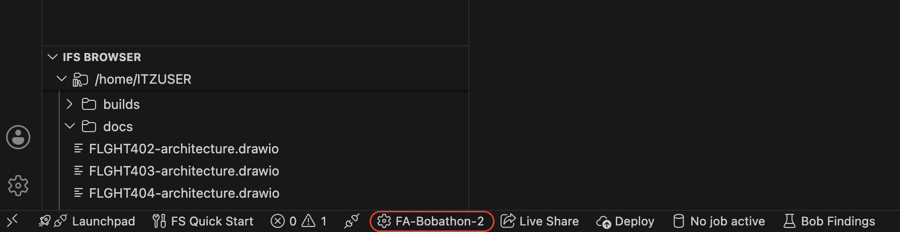
   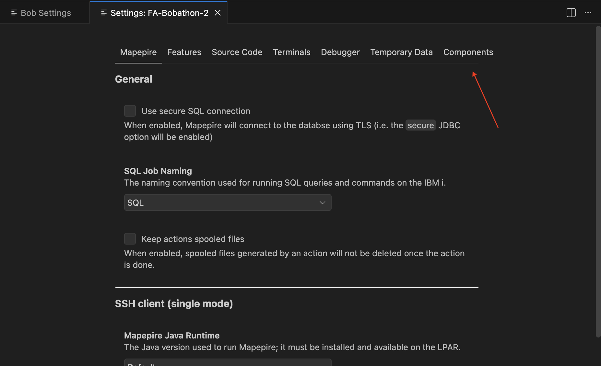
   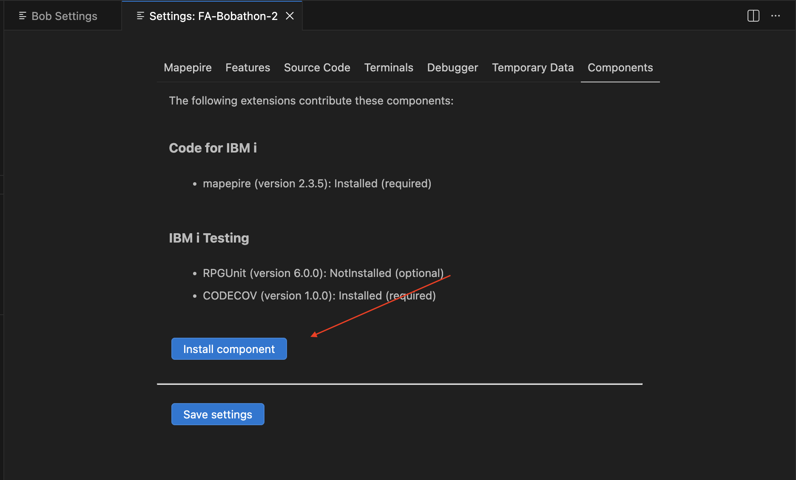
   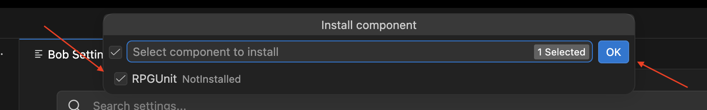

3. **Update your library list** — Add `RPGUNIT` and `QDEVTOOLS` to your User Library List the same way you added your own library during Setup. Your list should include `FLGHT4nn`, `RPGUNIT`, and `QDEVTOOLS`.

   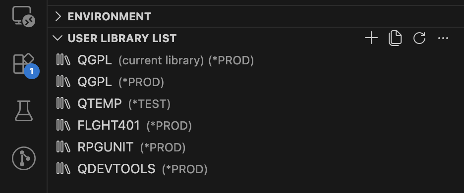

### 6a — Create the CUSTCHK Source Member

In the Object Browser, find the `QRPGLESRC` folder in your `FLGHT4nn` library. Right-click → **New Member**.


Enter the name **`CUSTCHK.SQLRPGLE`** and confirm. Paste the following source into the new member and save with **Ctrl/Cmd + S**:

```rpgle
**free
ctl-opt nomain;

dcl-proc checkCustomerExists export;
  dcl-pi *n ind;
    custId packed(9:0) const;
  end-pi;

  dcl-s rowCount int(10);

  exec sql
    select count(*)
      into :rowCount
      from CUSTOMRZ
      where CUSTNO = :custId;

  return (SQLCODE = 0 and rowCount > 0);
end-proc;
```

### 6b — Run the RPGUnit Test Plan Creation Workflow

Click the **workflow icon** at the top of the Bob panel and choose **RPGUnit Test Plan Creation** in your library list.


1. Click **Get Started** and select your library `FLGHT4nn`.
2. When prompted for the IFS project directory, enter a path unique to your library number, e.g. `/home/<user>/flght4nn`.
3. If this is your first time, tell Bob to **create a new test plan** when asked. Select the **default recommended path** for the goal. Let Bob locate testable files automatically — it should find `CUSTCHK.SQLRPGLE` as the only suitable candidate. Select the exported procedure and proceed. Choose to **validate the environment**.
4. If prompted to install **RPGUnit**, click **Install** and add it to your library list when asked. Do the same for **QDEVTOOLS** if prompted.

> 💡 If Bob asks to run the RPGUnit Test Plan Creation workflow again at any point, select **No thanks**.

Bob will write the test plan documents and store them in the IFS directory you specified. At the bottom of the chat panel, review the files it created — these Markdown documents will be used in 6c.

### 6c — Run the RPGUnit Test Suite Implementation Workflow

1. Click the **workflow icon** at the top of the Bob panel and choose **RPGUnit Test Suite Implementation** in your library list. Click **Proceed** (the test plan from 6b is already ready).
2. Select your library `FLGHT4nn`.
3. Enter the same IFS project directory used in 6b. Confirm the path to the test suites — Bob should pre-fill the correct default.
4. Choose to **validate the environment**. If Bob prompts to download RPGUnit again, click **Install**, then **Cancel** on the follow-up popup that asks to delete the existing version. Bob will generate the test source members, run the suites, and iterate until the new tests pass or Bob discovers an error in the source code.

   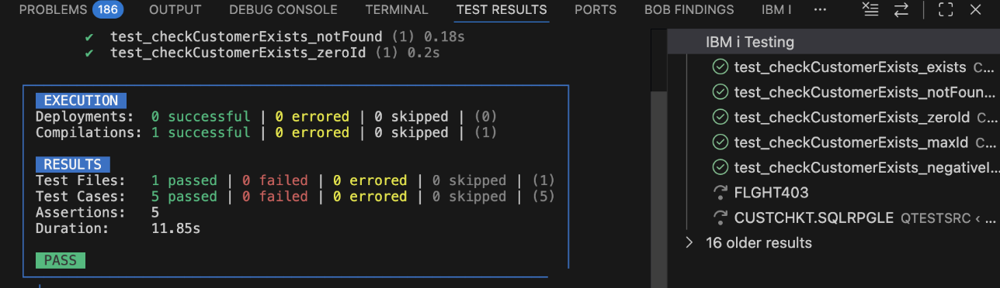

> 💡 If any tests fail, ask Bob to explain the failure and help fix it.

> ✅ **You've used Bob's guided workflows to go from untested legacy RPG to a structured, executed RPGUnit test suite** — without writing test boilerplate by hand.

---

## Exercise 7 — Generate a React Carbon App from a Green Screen *(Optional)*

**Goal:** Use Bob in IBM i Developer mode to analyze the FLIGHT400 5250 screen and generate a modern React web application styled with IBM Carbon, running directly on IBM i PASE. This exercise takes about 30 minutes to complete.

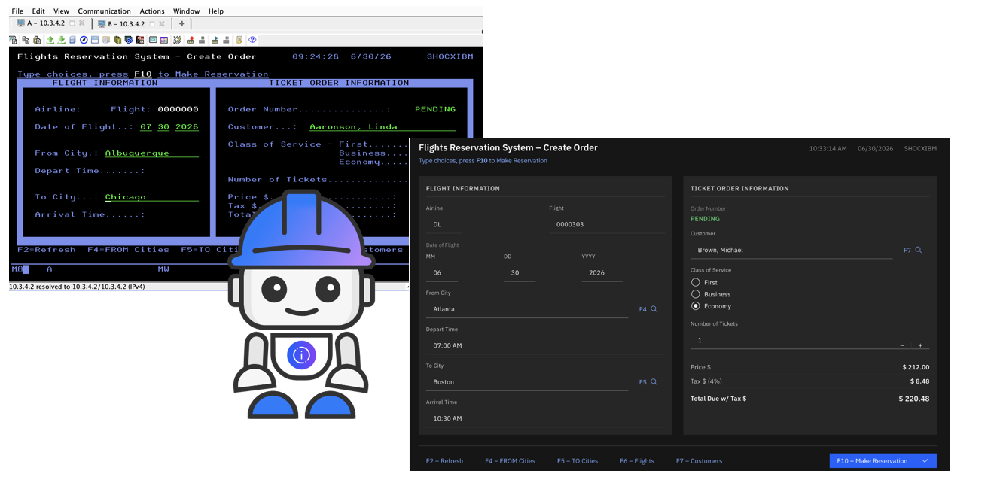

### Step 1 — Create a Helper Skill (Sharpen Your Skill)

Before generating the React app, give Bob extra context about running React + Vite on IBM i PASE by creating a small helper Skill.

1. In **Agent** mode, click the **+** button (top right) and select **Local Workspace** as the task context.
2. Open [`SAMPLE-SKILL.md`](./SAMPLE-SKILL.md), copy its entire content, paste it into the Bob chat, then append the following instruction and send:

   > *"Create a skill from the pasted text."*

### Step 2 — Generate the React App

Switch to **IBM i Developer** mode, then click the **+** button and select your **FLGHT4nn** library list as the context. Drag or paste the [FLIGHT400 screenshot](docs/img/flight400.png) into the Bob chat prompt, then replace `4nn` and `30nn` with your assigned numbers and send:

> *"Given this screenshot of the 5250 flight order screen from the Application Flight4nn in @FLGHT4nn, Build a single-page React 18 + Vite 4 app on IBM i (PASE) using @carbon/react ^1.x with the g100 dark theme that modernises the IBM i 5250 screen shown in the attached screenshot. Create the app in the IFS at $HOME/flight4nn-frontend-apps/screen-name/. Use the g100 dark theme. All fields should have a list of values to select from. The dev server must run in the background using nohup … & and write output to /tmp/vite-dev.log. Pin the Vite dev server to port 30nn if available."*

### Step 3 — Start the App and Open It in Your Browser

After Bob generates the files, ask Bob to start the dev server:

> *"Please start the dev server for the app you just created."*

Then open `http://localhost:30nn` in your browser — replacing `30nn` with your Dev Port from the Setup table.

> 💡 **Nothing showing in your browser?** Make sure you have completed Step 5 of Environment Setup (the SSH tunnel) and that it includes your port number.

### Wrap-Up — Skills & Tools Used Behind the Scenes

In addition to the sample Skill created in step 1, a set of unique Skills shipped with the **IBM Bob Premium Package for i** powered this exercise:

| Tool / Skill | Role |
|---|---|
| `dds-primer-basics` skill | Parses `FRS001DF.DSPF` — screen layout, field names, subfile windows |
| `rpg-primer-basics` skill | Reads `FRS001.RPG` — extracts pricing logic and field definitions |
| IFS write tools | Creates project files directly in `$HOME/flight4nn-react/` on IBM i |
| IBM i PASE | Runs `npm install`, `npm run build`, `npm start` natively on IBM i |

Once you finish playing around with the React app, ask Bob to stop it:

> *"Stop the web service for FLGHT4nn on port 30nn"*

> ⚠️ **This app runs with sample data only.** The natural next step is to add a REST / Web Services layer connecting the React front end to the real IBM i business logic and Db2 for i database.

---

## Summary

Congratulations! In this lab you:

| Exercise | What You Did |
|---|---|
| **Setup** | Installed Bob, connected to IBM i, and found your assigned library |
| **Exercise 1** | Generated architecture docs and an ERD with Bob |
| **Exercise 2** | Explained and modernized OPM RPG `FRS409` to free-format ILE RPG |
| **Exercise 3** | Added a new field end-to-end through DDS and RPG with Bob's help |
| **Exercise 4** | Reviewed and optimized a SQL query using Bob's database tools |
| **Exercise 5** | Queried your IBM i system using natural language |
| **Exercise 6** | Created and implemented an RPGUnit test suite with Bob's guided workflows |
| **Exercise 7** | Optional: Generated a React Carbon app from a 5250 green screen |

> **Next steps:** Explore connecting the React app to live IBM i data via a Node.js or Java REST API, or dive deeper into the RPG modernization workflow for the other FLIGHT4nn programs.
